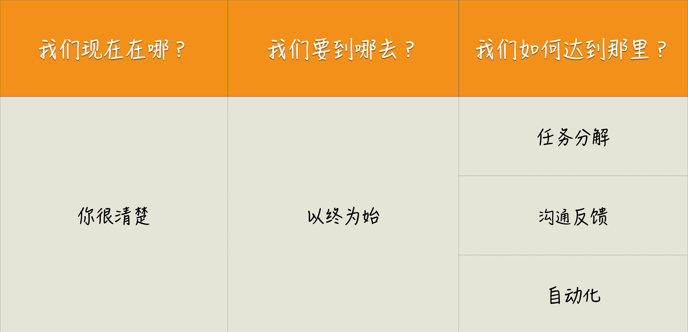

[toc]

## 01 | 10x 程序员是如何思考的？

### 一个思考框架

1.  **现状**：我们现在在哪？
2.  **目标**：我们要到哪儿去？
3.  **实现路径**：我们如何到达那里？

### 四个思考原则

1.  **以终为始**：确定好真实目标。

    -   为什么要做这个特性？
    -   它给用户带来的价值。

2.  **任务分解**：找到实施路径。

    -   具体使用场景。

3.  **沟通反馈**：解决与人打交道出现的问题。

    -   真正理解需求。

    -   上线后的衡量手段。

4.  **自动化**：解决与机器打交道出现的问题。

    -   没有自动化前是怎么做的。

### 小结

1.  
2.  一句话总结：**面对问题时，用思考框架问问自己，现在、目标和路径。**