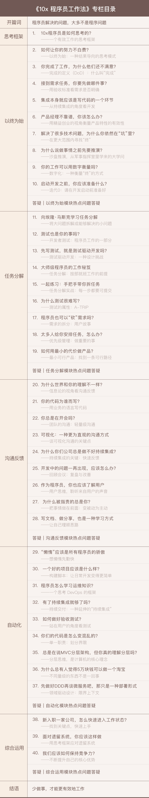

[toc]

## 开篇词 | 程序员解决的问题，大多不是程序问题

1.  **本质复杂度、偶然复杂度** -- 《人月神话》
2.  大部分程序员忙碌解决的问题，都不是程序问题，而是由偶然复杂度导致的问题。
3.  本专栏目标：
    -   **如何减少偶然复杂度引发的问题，让软件开发工作有序、高效地运行。**
    -   将精力聚焦在本质复杂度上。

4.  本专栏**概览**：

    -   一个框架：

        >   帮你在遇到问题时梳理自己真正要做的事情。

    -   四个原则：

        >   以终为始
        >
        >   任务分解
        >
        >   沟通反馈
        >
        >   自动化

5.  专栏**目录**：

    -   