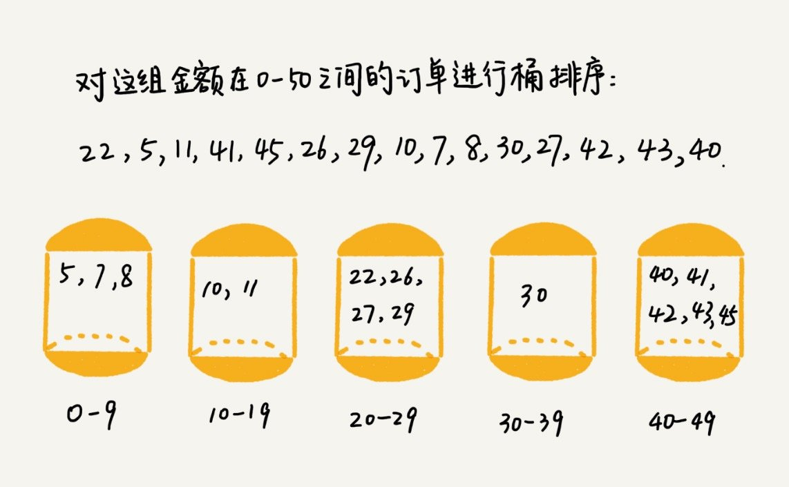
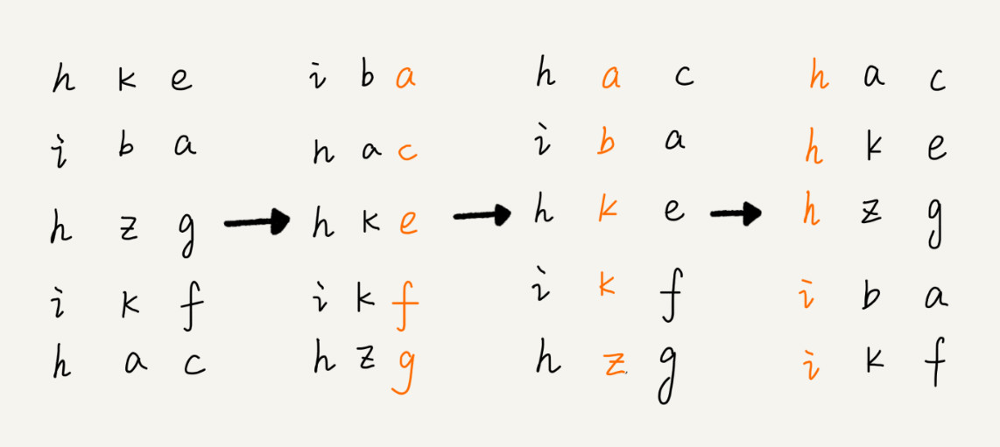

[TOC]


## 13 | 线性排序：如何根据年龄给 100 万用户数据排序？

1.  三种时间复杂度是 O(n) 的（**线性排序（Linear sort）**）排序算法：**桶排序**、**计数排序**、**基数排序**。
2.  学习重点：**掌握这些排序算法的适用场景。**
3.  开篇题：
    -   **如何根据年龄给 100 万用户排序？**
    -   有没有一种较之前排序更快的方法呢？

### 桶排序（Bucket sort）

1.  算法思想：
    1.  将要排序的数据分到几个有序的桶里，每个桶里的数据再单独进行排序。
    2.  桶内排序完成后，再把桶里的数据按照顺序依次取出，组成的序列就是有序的了。
2.  分解图
    -   
3.  时间复杂度
    -   `O(n)`
4.  桶排序是否可以替代我们之前讲的排序算法呢？
    -   不可以
    -   桶排序对要排序的数据的要求非常苛刻
5.  适用场景
    -   外部排序
    -   所谓外部排序就是数据存储在外部磁盘中，数据量较大，内存有限，无法将数据全部加载到内存中。

### 计数排序（Counting sort）

1.  计数排序其实是桶排序的一种特殊情况。
2.  算法思想
    -   当要排序 n 个数据，所处的范围并不大的时候，比如最大值是 k，我们就可以把数据划分成 k 个桶。
    -   每个桶内的数据值都相同的，**省掉了桶内的排序时间**。
3.  时间复杂度
    
    -   `O(n)`
4.  适用场景
    -   **数据范围不大**的场景中。如果数据范围 k 比要排序的数据 n 大很多，就不适合用计数排序了。
    -   计数排序只能给**非负整数**排序，如果要排序的数据是其地类型的，要将其在不改变相对大小的情况下，转化为非负整数。
5.  实现：**为什么这个排序算法叫“计数排序”呢？“计数”的含义来自哪里呢？**
    1.  背景
        
        -   假设只有 8 个考生，分数在 0 到 5 分之间。这 8 个考生的成绩我们放在一个数组 A[8]中，它们分别是：2，5，3，0，2，3，0，3。
        
    2.  生成 C[6]
        -   考生的成绩从 0 到 5 分，我们使用大小为 6 的数组 C[6]表示桶。
        -   其中**下标对应分数**。不过，C[6]内存储的并不是考生，而是**对应的考生个数**。
        -   
        -   我们对 C[6]数组顺序求和，C[6]存储的数据就变成了下面这样子。C[k]里存储小于等于分数 k 的考生个数。
        -   
        
    3.  **A -> C -> R(排序后) 转换思路**（重点）

        >   我们从后到前依次扫描数组 A。
        >
        >   比如，当扫描到 3 时，我们可以从数组 C 中取出下标为 3 的值 7，也就是说，到目前为止，包括自己在内，分数小于等于 3 的考生有 7 个，也就是说 3 是数组 R 中的第 7 个元素（也就是数组 R 中下标为 6 的位置）。
        >
        >   当 3 放入到数组 R 中后，小于等于 3 的元素就只剩下了 6 个了，所以相应的 C[3]要减 1，变成 6。

    4.  分解图（重点理解）

        -   

    5.  代码（重点理解转换思路）

        -   ```java
            
            // 计数排序，a是数组，n是数组大小。假设数组中存储的都是非负整数。
            public void countingSort(int[] a, int n) {
              if (n <= 1) return;
            
              // 查找数组中数据的范围
              int max = a[0];
              for (int i = 1; i < n; ++i) {
                if (max < a[i]) {
                  max = a[i];
                }
              }
            
              int[] c = new int[max + 1]; // 申请一个计数数组c，下标大小[0,max]
              for (int i = 0; i <= max; ++i) {
                c[i] = 0;
              }
            
              // 计算每个元素的个数，放入c中
              for (int i = 0; i < n; ++i) {
                c[a[i]]++;
              }
            
              // 依次累加
              for (int i = 1; i <= max; ++i) {
                c[i] = c[i-1] + c[i];
              }
            
              // 临时数组r，存储排序之后的结果
              int[] r = new int[n];
              // 计算排序的关键步骤，有点难理解
              for (int i = n - 1; i >= 0; --i) {
                int index = c[a[i]]-1;
                r[index] = a[i];
                c[a[i]]--;
              }
            
              // 将结果拷贝给a数组
              for (int i = 0; i < n; ++i) {
                a[i] = r[i];
              }
            }
            ```


### 基数排序（Radix sort）

1.  适用场景
    -   **数据范围较大**（如手机号有 11 位），需要可以分割出独立的“位”来比较，而且位之间有递进的关系，如果 a 数据的高位比 b 数据大，那剩下的低位就不用比较了。
    -   此外，每一位的数据范围不能太大，要可以用线性排序算法来排序，否则，基数排序的时间复杂度就无法做到 O(n) 了
2.  分解图
    -   
3.  思路
    1.   先按照最后一位来排序
    2.   再按照倒数第二位重新排序
    3.   以此类推，最后按照第一位重新排序
4.  时间复杂度
    -   如果每一位排序的时间复杂度是 `O(n)` ，如果数据有 k 位的话，总的时间复杂度是 O(k*n)。
    -   如果 k 不大的时候，时间复杂度就近似于 `O(n)`

### 解答开篇

1.  如何根据年龄来给 100 万用户排序？

2.  思路：
    -   假设年龄的范围是 1～120。
    -   **我们就可以遍历这100 万个用户，根据年龄将其划分到这 120 个桶里，然后依次顺序遍历这 120 个桶中的元素。**
    -   这样就得到了按照年龄排序的 100 万用户数据。


### 课后思考

1.  假设我们现在需要对 D, a, F, B, c, A, z 这个字符串进行排序，要求将其中所有小写字母都排在大写字母前面，但，小写字母和大写字母内部不要求有序。比如经过排序之后为 a，c，z，D，F，B，A，这个如何来实现呢？

### 精选留言

1.  #wucj（原地排序）

    >   用两个指针a、b
    >
    >   a指针从头开始往后遍历，遇到大写字母就停下，b从后往前遍历，遇到小写字母就停下，交换a、b指针对应的元素
    >
    >   重复如上过程，直到a、b指针相交。
    >
    >   对于小写字母放前面，数字放中间，大写字母放后面，可以先将数据分为小写字母和非小写字母两大类，进行如上交换后再在非小写字母区间内分为数字和大写字母做同样处理

2.  #伟忠（会占用额外的空间）

    >   利用桶排序思想，弄小写，大写，数字三个桶，遍历一遍，都放进去，然后再从桶中取出来就行了。相当于遍历了两遍，复杂度O(n)

