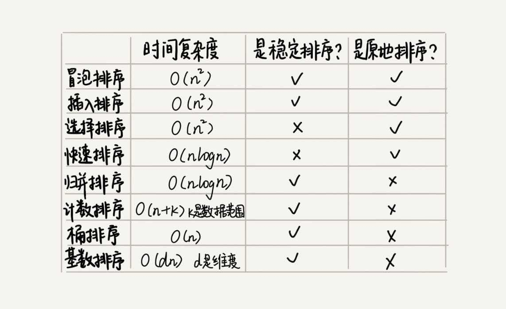

[TOC]

## 14 | 排序优化：如何实现一个通用的、高性能的排序函数？ 

1.  开篇题：
    -   如何实现一个通用的、高性能的排序函数？

### 如何选择合适的排序算法？

1.  回顾前面的几种排序算法
    1.  对比
        -   
    2.  分析这几类排序算法
        -   **线性排序算法**
            -   时间复杂度比较低，适用场景比较**特殊**。所以如果要写一个通用的排序函数，不能选择线性排序算法
        -   **小规模数据**进行排序，可以选择时间复杂度是 O(n2) 的算法
        -   **大规模数据**进行排序，时间复杂度是 O(nlogn) 的算法更加高效。**（首选）**
    3.  O(nlogn) 的几种算法分析
        -   归并排序
            -   平均情况、最坏情况下的时间复杂度都是 O(nlogn)
            -   不是原地排序算法，空间复杂度是 O(n)
        -   **快速排序**（比较适合来实现排序函数）
            -   最好情况下的时间复杂度是 O(n); 最坏情况下的时间复杂度是 O(n^2)
            -   是原地排序算法，通过优化 partition 函数，可以实现原地排序，空间复杂度是 O(1)
        -   堆排序
            -   后面会讲到，这里暂不做分析。

### 如何优化快速排序

1.  为什么最坏情况下快速排序的时间复杂度是 O(n^2) 呢？
    -   因为我们**分区点选得不够合理**。
    -   如果数据原来就是有序的或者接近有序的，每次分区点都选择最后一个数据，那快速排序算法就会变得非常糟糕，时间复杂度就会退化为 O(n^2)。
2.  什么样的分区点是好的分区点呢？
    -   最理想的分区点是：**被分区点分开的两个分区中，数据的数量差不多。**
3.  两种较常用、简单的分区算法
    1.  **三数取中法**
        -   我们从区间的**首、尾、中间**，分别取出一个数，然后对比大小，取这 3 个数的**中间值**作为分区点。
        -   如果要排序的**数组比较大**，“三数取中” 可以转化为 “五数取中”、“十数取中”。
    2.  **随机法**
        -   每次从要排序的区间中，随机选择一个元素作为分区点。
        -   此法不能保证每次分区点选的比较好，但，从概率论角度，也不大可能每次都很差。

### 举例分析 Glibc #qsort() 函数

1.  优先：使用归并排序
2.  数据量较大时：使用快速排序
    -   使用 “三数取中法”，选择分区点。
3.  数据量小于等于 4 时：使用插入排序

4.  `qsort()` 也利用哨兵这咱编程技巧（极致的性能优化）

### 课后思考

+ 今天，我们一起分析了 `qsort()` 的实现，你能否分析下你所熟悉的语言中的排序函数都是用什么排序算法来实现的呢？都有哪些优化技巧？

### 精先留言

1.  #刘強

    >   **思考的过程比标准答案更重要**。

2.  #Liam

    >   查看了下Arrays.sort的源码，主要采用TimSort算法, 大致思路是这样的：
    >
    >   
    >
    >   1 元素个数 < 32, 采用二分查找插入排序(Binary Sort)
    >
    >   2 元素个数 >= 32, 采用归并排序，归并的核心是分区(Run)
    >
    >   3 找连续升或降的序列作为分区，分区最终被调整为升序后压入栈
    >
    >   4 如果分区长度太小，通过二分插入排序扩充分区长度到分区最小阙值
    >
    >   5 每次压入栈，都要检查栈内已存在的分区是否满足合并条件，满足则进行合并
    >
    >   6 最终栈内的分区被全部合并，得到一个排序好的数组
    >
    >   
    >
    >   Timsort的**合并算法**非常巧妙：
    >
    >   1 找出左分区最后一个元素(最大)及在右分区的位置
    >
    >   2 找出右分区第一个元素(最小)及在左分区的位置
    >
    >   3 仅对这两个位置之间的元素进行合并，之外的元素本身就是有序的