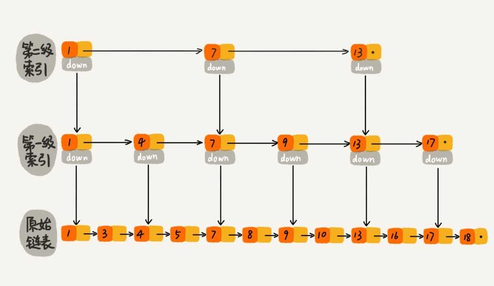

[TOC]

## 17 | 跳表：为什么 Redis 一定要用跳表来实现有序集合？

1.  开篇题

​	- **Redis 为什么会选择用跳表来实现有序集合？**为什么不用红黑树呢？

### 理解"跳表"？

1.  怎么来提高单链表查找`O(n)`效率呢？
    -   如图，**对链表建立“索引”**
    -   
    -   一个较为明显的例子，**当链表长度 n 比较大时，在构建索引之后，查找效率的提升就会非常明显。**
    -   
2.  概念：
    -   基于**单链表**实现了**二分查找**
    -   **这种链表加多级索引的结构**，就是跳表。

### 查询时间复杂度

1.  分析：
    -   一个具有多级索引的跳表中，查询某个数据的时间复杂度是多少？

    -   如果链表里有 n 个结点，会有多少级索引呢？
        + 按刚才讲的，**每两个结点会抽出一个结点作为上一级索引的结点**。
        + 第一级结点个数大约就是 n/2， n/(2$^1$)
        + 第二级结点个数大约是 n/4， n/(2$^2$)
        + 第三级结点个数大约是 n/8， n/(2$^3$)
        + ……
        + 第 **k** 级**结点个数**是 **n/(2$^k$)**
        + 假设索引有 h 级，最高级的索引有 2 个结点。通过上面的公式，我们可以得出 n/($2^h$)=2，求得 h=$log_2n$-1。如果包含原始链表这一层，整个**跳表的高度**就是 $log_2n$。
	-	我们在跳表中查询某个数据的时候，如果每一层都要遍历 m 个结点，那在跳表查询一个数据的时间复杂度就是`O(m*logn)`。
2.  在跳表中**查询任意数据的时间复杂度是 `O(logn)`。**
3.  设计思路：**空间换时间**

### 空间复杂度

1.  假设，原始链表大小为 n ，第一级索引大约在 n/2 个结点，第二级索引大约在 n/4 个结点，以此类推，每上升一级就减少一半，直到剩下 2 个结点。
    -   
    -   这几级索引结点的总和是 `n/2 + n/4 + n/8 ... 8 + 4 + 2 = n-2`，所以，**跳表的空间复杂度就是 `O(n)`。**
2.  在软件开发中， 我们不必太过在意索引占用的额外空间。
    -   当**对象比索引结点大很多时**，那索引占用的额外空间就可以忽略了

### 动态插入和删除

1.  跳表插入、删除操作的时间复杂度也是 `O(logn)`。
2.  插入时间复杂度`O(n)`　＝　查询时间复杂度`O(n)`　＋　插入时间复杂度`O(1)`

3.  插入过程
    -   
4.  删除时间复杂度`O(n)`　＝　查询时间复杂度`O(n)`　＋　删除时间复杂度`O(1)`

### 索引动态更新

1. 问题

    -   当我们不停的往跳表中插入数据时，如果我们不更新索引，就有可能出现某 2 个索引结点间的数据非常多的情况。极端情况下，跳表还会退化成单链表。

    -   

    -   作为一种动态数据结构，我们需要某种手段来维护索引与原始链表大小间的平衡，避免查找、插入、删除操作性能下降。

2.　解决方案

    -   跳表是通过**随机函数**来维护前面提到的 “平衡性”。

        >   当我们往跳表中插入数据的时候，我们可以选择同时将这个数据插入到部分索引层中。
        >
        >   我们通过一个随机函数，来**决定将这个结点插入到哪几级索引中**。
        >
        >   

### 解答开篇

1.  开篇题

    - 为什么 redis 要用跳表来实现有序集合，而不是红黑树？

    
2.　　分析

    1.　**按照区间来查找数据**这个操作，红黑树的效率没有跳表高。
    
    2.　跳表可以做到 `O(logn)` 的时间复杂度定位区间的起点，然后在原始链表中顺序往后遍历就可以了。
    
    3.　其他
    
        -   跳表更容易实现（相比红黑树），可读性好，不容易出错
	
        -   跳表更加灵活，它可以通过改变索引构建策略，有效平衡执行效率和内存消耗。
	
    4.　跳表也不能完全替代红黑树。因为红黑树比跳表的出现更早一些，很多编程语言中 Map 类型都是通过红黑树来实现的。

### 课后思考

1.　如果跳表中每三个或者五个结点提取一个结点作为上级索引，对应在跳表中查询数据的时间复杂度是多少呢？

#### 精选留言

1.　
