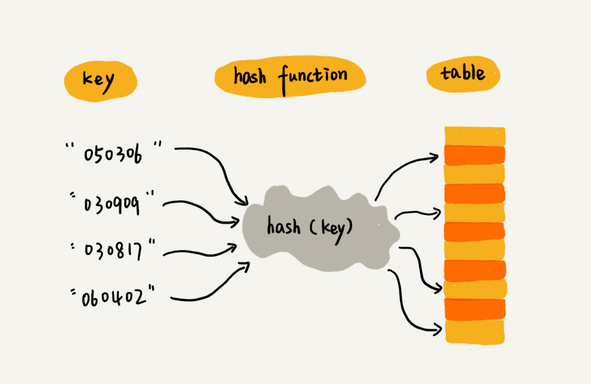

[TOC]

## 18 | 散列表（上）： Word 文档中的单词拼写检查功能是如何实现的？

1.  开篇题
    -   word 的单词拼写检查功能，这个功能是如何实现的？

### 散列思想

1.  散列表（Hash Table，哈希表，Hash 表）
2.  思想
    -   散列表用的是**数组**支持按照下标**随机访问数据**的特性
    -   所以散列表其实就是数组的一种扩展，由数组演化而来。可以说，如果没有数组，就没散列表。
3.  示例
    -   我们通过散列函数把元素的键（key）映射为下标，然后将数据存储在数组中对应下标的位置。
    -   当我们按照键（key）查询元素时，我们用同样的散列函数，将键值转化数组下标，从对应数组下标的位置取数据。
    -   

### 散列函数

1.  概念
    -   顾名思义，是一个函数。可以定义成 hash(key)，其中 key 表示元素的键值，hash(key) 的值表示经过散列函数计算得到的散列值。

2.  设计要求：

    1. 散列函数计算得到的散列值是一个**非负整数**。
        - 因为数组下标是从 0 开始的
    2. 如果 `key1 = key2`， 那 `hash(key1) == hash(key2)`。
    3. 如果 `key1 != key2`，那 `hash(key1) != hash(key2)`。
        -   一个无法避免的问题：**散列冲突**

### 散列冲突

1.  常用的解决方案
    -   开放寻址法（open addressing） 
    -   链表法（chaining）。

2.  **开放寻址法**

    - 核心思想，**如果出现散列冲突，我们就重新探测一个空闲的位置，将其插入。**

3. 如果探测新的位置呢？

    1.  **线性探测（Linear Probing）**。

        -  **插入**
        - 如果某个数据经过散列函数散列后，存储位置已经被占用了，**我们就从当前位置开始，依次住后查找，看是否有空间位置，直到找到为止。**
            - 
        - **查找**
        - 我们通过散列函数求出要查找元素的键值对应的散列值，然后比较数组中下标为散列值的元素和要查找的元素。
            - 如果相等，说明就是我们要找的元素。否则，就顺序往后依次查找。
            - 如果遍历到数组**空闲位置**，还没有找到，就说明要查找的元素并没有在散列表中。
            - 
        -  问题
            - 当散列表中插入数据越来越多时，散列冲突发生的可能性就会越来越大，空闲位置会越来越少，线性探测的时间就会越来越久。
            - 极端情况下，我们可能需要探测整个散列表，所以最坏情况时间复杂度为 `O(n)`。

    

    2.  其他

        >   **二次探测（Quadratic probing）**
        >
        >   **双重散列（Double hashing）**

4.  **链表法**

    - 如图，在散列表中，每个“桶（backet）” 或“槽（slot）” 会对应一条**链表**。
    - **散列值相同**的元素我们都放到**相同的槽位**对应的链表中。
    - 
    - 插入 时间复杂度
        - `O(1)`。
    - 查找/删除 时间复杂度
        - 链表长度为 k，即，时间复杂度为`O(k)`。
        - 理论上讲（散列比较**均匀**）`k = n/m`（n 表示散列中数据的个数，m 表示散列表中“槽”的个数）

### 解答开篇

1.  开篇题
    -   word 文档中单词拼写检查功能是如何实现的？
2.  解决思路

    + 我们可以用**散列表**来存储整个英文单词词典。
    + 当用户输入某个英文单词时，我们拿用户输入的单词去散列表中查找。
    + 如果找到说明拼写正确，如果没查找到，说明拼写有问题，给予提示。

### 小结

1.  散列表两个核心问题
    -   **散列函数设计**
    -   **散列冲突解决**

### 课后思考

1. 假设我们有 10 万条 URL 访问日志，如何按照访问次数给 URL 排序？
2. 有两个字符串数组，每个数组大约有 10 万条字符串，如何快速找出两个数组中相同的字符串？

#### 精选留言

1.  #Smallfly

    >   1. 假设我们有 10 万条 URL 访问日志，如何按照访问次数给 URL 排序？
    >       1. 遍历 10 万条数据，以 URL 为 key，访问次数为 value，存入散列表，同时记录下访问次数最大值值 K ，时间复杂度 `O(n)`。
    >       
    >       2. 如果 **K 不是很大**，可以使用**桶排序**，时间复杂度 `O(n)`。
    >       
    >       3. 如果 **K 很大**，就使用**快排**，时间复杂度是 `O(nlogn)`。
    >       
    >           
    >   2. 有两个字符串数组，每个数组大约有 10 万条字符串，如何快速找出两个数组中相同的字符串？
    >       1. 以第一个字符串数组构建散列表，key 为字符串，value 为出现次数。
    >       2. 再遍历第二个字符串数组，以字符串为 key 在散列中查找，如果 value 大于零，说明存在相同字符串。时间复杂度为 `O(n)`。

