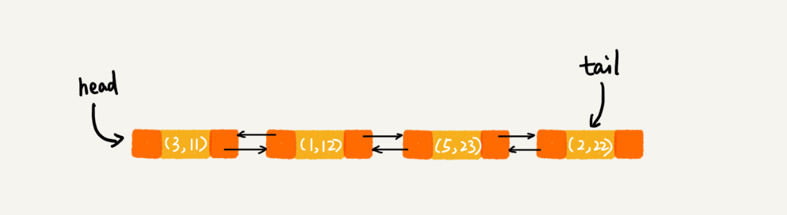

[TOC]

## 20 | 散列表（下）：为什么散列表和链表经常会一起使用？


1.  散列表和链表的组合使用场景

    - LRU 缓存淘汰算法
    - redis 有序集合中的跳表（改进版的链表），不仅使用跳表，还用到了散列表
    - java 中 LinkedHashMap

2.  开篇题
    -   为什么散列表和链表会经常放到一起使用。

### LRU 缓存淘汰算法

1.  一个缓存系统主要包含的几个操作：
    - 添加
    - 删除
    - 查找
2.  单纯使用链表，时间复杂度是 `O(n)`。
3.  **散列表和链表组合**使用，时间复杂度是 `O(1)`。
    -   
    - 每个结点会在两条链中
        - 一个链是常规的**双向链表**
        - 一个链是散列表中的**拉链**
	- 查找/删除/添加的时间复杂度都是 `O(1)`


### Redis 有序集合

1.  在有序集合中，每个成员对象的两个重要属性：
    - **key 键值**
    - **score 分值**
2.  redis 有序集合操作：
    - 添加
    - 删除
    - 查找
    - 按分值区间来查找数据
    - 按分值从小到大排序成员变量
3.  复杂度分析
	- 按照键值构建一个散列表，这样按 key 来删除、查找一个成员对象的时间复杂度就变成了 `O(1)`。
	- 借助跳表结构，其他操作也是非常高效。

### Java LinkedHashMap

1.  LinkedHashMap 按照**插入顺序**遍历数据，还支持按照**访问顺序**来遍历数据

    - ```java
        HashMap<Integer, Integer> m = new LinkedHashMap<>();
        m.put(3, 11);
        m.put(1, 12);
        m.put(5, 23);
        m.put(2, 22);

        for (Map.Entry e : m.entrySet()) {
          System.out.println(e.getKey());
        }

        // output: 3，1，5，2

        ```

    - ```java
        // 10 是初始大小，0.75 是装载因子，true 是表示按照访问时间排序
        HashMap<Integer, Integer> m = new LinkedHashMap<>(10, 0.75f, true);
        m.put(3, 11);
        m.put(1, 12);
        m.put(5, 23);
        m.put(2, 22);

        m.put(3, 26);
        m.get(5);

        for (Map.Entry e : m.entrySet()) {
          System.out.println(e.getKey());
        }

        // output: 1，2，3，5

        ```

2.  例 2 代码分析
    -   四次 put() 操作完后，链表中数据如下
    -   
    -   第 8 行，m.put(3, 26) 后，链表中数据如下：
    -   
    -   第 9 行，m.get(5) 后。链表中数据如下：
    -   

3.  小结

    - LinkedHashMap 是通过**双向链表和散列表**这两种数据结构组合实现的。
    - LinkedHashMap 中 Linked 实际上是指的是**双向链表**，并非指定用链表法解决散列冲突。

### 解答开篇 & 内容小结

1.  开篇题：
    -   为什么散列表和链表经常一块使用？

- 为什么散列表和链表经常一块使用？
    - 散列表这种数据结构虽然支持非常高效的数据插入、删除、查找操作。
    - 但是，散列表中的数据都是通过散列函数打乱后无规律存储的。也就说，它无法支持按照某种顺序快速地遍历数据。
    - 如果希望按照顺序遍历散列表中的数据，那我们需要将数据拷贝到数组中，然后排序，再遍历。
    - **因为散列表是动态数据结构，不停地有数据的插入、删除，所以每当我们希望按顺序遍历散列表中的数据的时候，都需要先排序，那效率势必会很低。**
    - 为了解决这种问题，我们将**散列表和链表（或跳表）**结合在一起使用。

### 课后思考

1. 如果把今天讲的几个例子里的双向链表改成单链表，是否还能正常工作？为什么呢？
2. 假设猎聘网有 10万个猎头，每个猎头都可以通过做任务来积累积分，然后通过积分来下载简历。那我们如何在内存中存储这 10 万个猎头 ID 和积分信息，让他支持如下几个操作。
    1. 根据猎头的 ID 快速查找、删除、更新这个猎头的积分信息。
    2. 查找积分在某个区间的猎头 ID 列表。
    3. 查找按照积分从小到大排名在第 x 位到第 y 位间的猎头 ID 列表。

### 精选留言

1.  @Smallfly

    - 散列表、链表、跳表混合使用，是为了结合数据和链表的优势，规避它们的不足。
    - 我们可以得到数据结构和算法的重要性排行榜： 连续空间 > 时间 > 碎片空间。

2.  @Smallfly

    1. 在删除一个元素时，虽然能`O(1)`找到目标结点，但是要删除该结点需要拿到前一个结点的指针，遍历到前一个结点复杂度会变为 `O(n)` ，所以用双链表实现比较合适。
    2. 以积分排序构建一个跳表，再以猎头 ID 构建一个散列表。
        1. ID 在散列表中，所以可以 `O(1)` 查找这个猎头。
        2. 积分以跳表存储，跳表支持区间查询。
        3. 这点根据目前学习暂时无法实现。