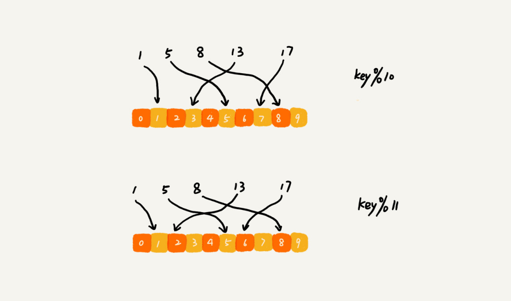

[TOC]

## 22 | 哈希算法（下）：哈希算法在分布式系统中有哪些应用？

1.  哈希算法是如何解决这些分布式问题的？
    -   负载均衡
    -   数据分片
    -   分布式存储

### 应用五：负载均衡

1.  需求：
    -   实现一个会话粘滞（session sticky）的负载均衡算法。（同一客户端上，一次会话中的所有请求都路由到同一服务器上。）
2.  思路
    -   通过哈希算法，对客户端 IP 地址或者会话 ID 计算哈希值
    -   **将取得的哈希值与服务器列表的大小进行取模运算**
    -   最终得到的值就是应该被路由到的服务器编号。

### 应用六：数据分片

1. 统计“关键词”出现次数？

    -   需求

        >   假设，有 1T 的日志文件，里而记录了用户的搜索关键词。
        >
        >   我们想要快速统计出每个关键词被搜索的次数，该怎么办？

    -   难点

        >   1.  空间，日志量很大，没办法放到一台机器的内存中。
        >   2.  时间：就算用一台机器来处理这么大的数据，处理时间会很长。

    -   思路

        >   先对数据进行分片，然后采用多台机器处理的方法，来提高处理速度。

    -   数据分片思路

        >   对搜索关键词，通过哈希函数**计算哈希值**
        >
        >   然后**跟 n （机器数量）取模**
        >
        >   最终得到的值，就是应该被分配到的机器的编号。

2.  如何快速判断图片是否在图库中？

    -   需求

        >   假设，我们图库中有 1 亿张图片，如何判断图片是否在图库中呢？

    -   难点

        >   单台机器上构建散列表肯定是行不通的。（单机内存有限）

    -   思路：

        >   采用多机处理，准备 n 台机器，让每台机器只维护某一部分图片对应的散列表。
        >
        >   我们每次读取一个图片，**计算唯一标识，然后与机器个数 n 求余取模**
        >
        >   得到的值就是对应要分配机器的编号，然后将这个图片的唯一标识和图片路径发往对应的机器构建散列表。

### 应用七：分布式存储

1.  需求
    -   在分布式缓存中。
    -   有海量数据需要缓存。
    -   如何将数据分布在多台机器上？
2.  难点
    -   **那如何决定将哪个数据放到哪个机器上呢？**
3.  思路
    -   借助数据分片的思想
    -   **通过哈希算法对数据取哈希值，然后对机器个数取模**
    -   最终值就是应该存储的缓存机器编号。
4.  扩容
    -   随着数据增多，原来 10 个机器已经无法承受了。我们就需要**扩容**。
    -   这里并不是简单的加个机器就可以了。每个机器上缓存数据也需要重新分配存储的机器。
        -   
5.  扩容难点
    -   所有数据都需要重新计算哈希值，然后重新搬移到正确的机器上。
    -   这就相当于，所以缓存一下子就都失效了。所有数据请求都会穿透缓存，直接去请求数据库。这样就可能发生**雪崩效应**，压垮数据库。
6.  思路
    -   **一致性哈希算法**

### 课后思考 

- 除了我们这两节讲的七个哈希算法的应用，你还能想到其他用到哈希算法的地方吗？

    