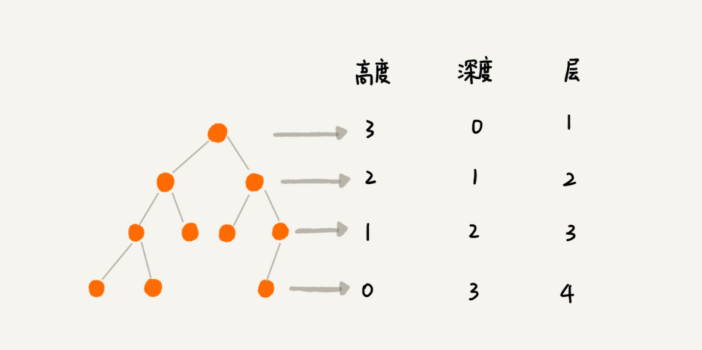
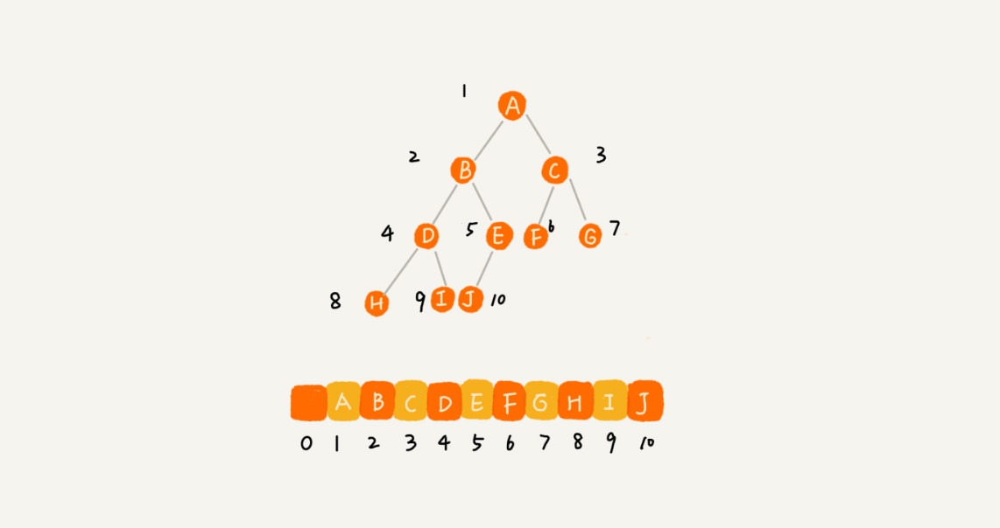
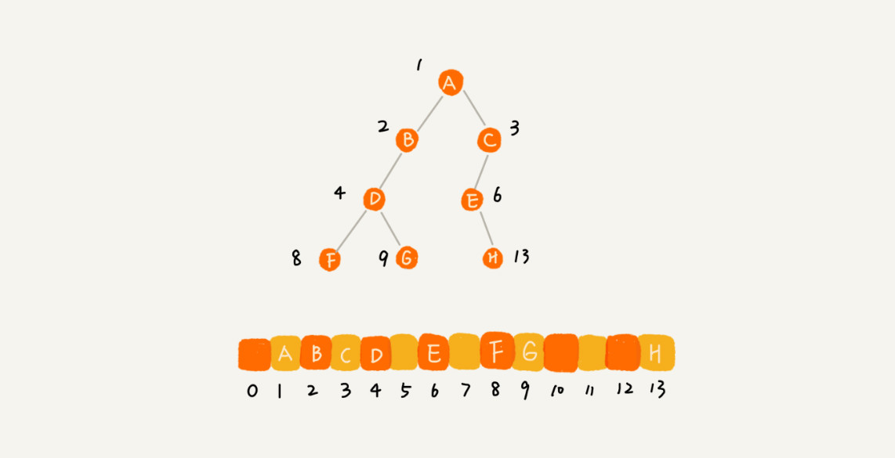

[TOC]

## 23 | 二叉树基础（上）： 什么样的二叉树适合用数组来存储？


1.  开篇题
    -   二叉树有哪几种**存储方式**？什么样的二叉树适合用**数组来存储**？

### 树（Tree）

1.  概念

    -   

    - A 就是 B 的**父节点**，
    - B 是 A 的**子节点**。
    - B，C，D 这三个节点的父节点是同一节点，所以，它们互称**兄弟节点**。
    - 我们把没有父节点的的节点叫**根节点**，也就是图中的 E。
    - 我们把没有子节点的节点叫作**叶子节点或者叶节点**。如，G, H, I, J, K, L。

    -   

    - **高度（Height）**
        - 从下往上，计数起点是 0。
    - **深度（Depth）**
        - 从上往下，计数起点是 0。
    - **层（Level）**
        - 从上往下，计数起点是 1。

### 二叉树（Binary Tree）

1.  概念

    -   
	-   二叉树每个节点最多两个叉，也就是两个子节点，分别是**左子节点**和**右子节点**。
    -   二叉树并不要求每个节点都有两个子节点，有的节点只有左子节点，有的节点只有右子节点。
    -   
	- **满二叉树**，叶子节点全都在最底层，除了叶子节点外，每个节点都有左右两个子节点。
    - **完全二叉树**，叶子节点都在最底下两层，最后一层的叶子节点都靠左排序，并且除了最后一层，其他层的节点个数都要达到最大
2.  如何表示（**存储**）一棵二叉树？

    - **链式存储法**
        - 
    - **数组存储法**
        - **根节点（父节点**）存储在下标 `i=1` 的位置，那它**左子节点**存储在下标 `2 * i = 2` 的位置，**右子节点**存储在 `2*i+1=3` 的位置。
        - 反过来，下标为 `i/2` 的位置存储的就是它的**父节点**。
        - 完全二叉树
            - 
        - 非完全二叉树
            - 
    - 小结
        - 如果是一棵**完全二叉树**，那用**数组存储**无疑是最节省内存的一种方式。因为数组存储方式并不需要像链式存储法那样，要存储额外的左右子节点的指针。
        - 这也是为什么完全二叉树会单独拎出来的原因，也是为什么完全二叉树要求**最后一层子节点都靠左**的原因。
        - **堆**就是一个完全二叉树，最常用的存储方式就是数组。

### 二叉树的遍历

1. **前序遍历**

    - 先打印本身节点，再打印左子树，最后打印右子树。
2. **中序遍历**

    - 先打印左子树，再打印本身节点，最后打印右子树。
3. **后序遍历**
- 先打印左子树，然后再打印右子树，最后打印节点本身。
4. 递归实现
    -   

    - **递推公式**

      - ```java
        前序遍历的递推公式：
        preOrder(r) = print r->preOrder(r->left)->preOrder(r->right)

        中序遍历的递推公式：
        inOrder(r) = inOrder(r->left)->print r->inOrder(r->right)

        后序遍历的递推公式：
        postOrder(r) = postOrder(r->left)->postOrder(r->right)->print r

        ```

    - **递归代码**

        - ```java
            void preOrder(Node* root) {
              if (root == null) return;
              print root // 此处为伪代码，表示打印 root 节点
              preOrder(root->left);
              preOrder(root->right);
            }

            void inOrder(Node* root) {
              if (root == null) return;
              inOrder(root->left);
              print root // 此处为伪代码，表示打印 root 节点
              inOrder(root->right);
            }

            void postOrder(Node* root) {
              if (root == null) return;
              postOrder(root->left);
              postOrder(root->right);
              print root // 此处为伪代码，表示打印 root 节点
            }

            ```

5.  复杂度分析
    
    -   从图中，可以看出，每个节点最多会被访问两次。所以，二叉树遍历的时间复杂度是 `O(n)`。

### 课后思考

1. 给定一组数据，比如 1，3，5，6，9，10。你来算算，可以构建出多少种不同的二叉树？
2. 如何实现二叉树按层遍历？

### 精选留言

1.  #meng

    >   关于问题1，如果是完全二叉树，
    >
    >   老师说过可以放在数组里面，那么问题是否 可以简化为数组内的元素有多少种组合方式，
    >
    >   这样的话，就是 n!，不知是否可以这样理解 ？

