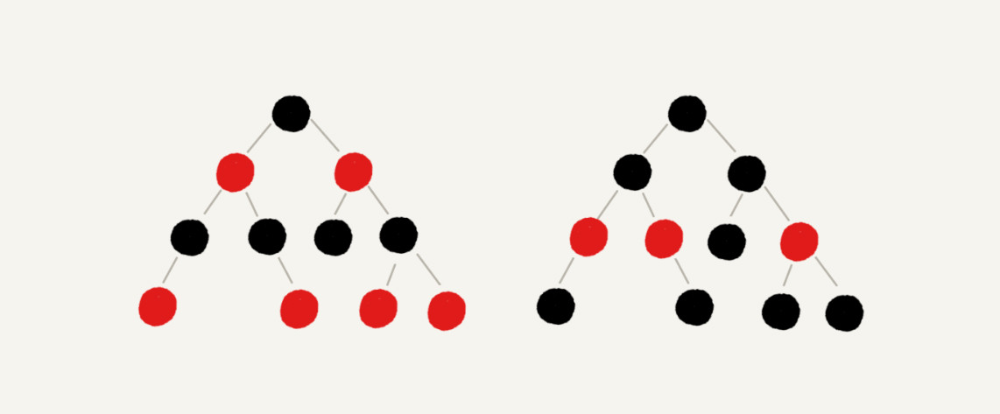

[TOC]

## 25 | 红黑树（上）：为什么工程中都用红黑树这种二叉树？

1.  开篇题
    -   为什么工程中都喜欢用**红黑树**，而不是其他平衡二叉查找树呢？

### 平衡二叉查找树

1.  概念
    - 二叉树中任意一个节点的左右子树的**高度相差不能大于 1**
    - 
2.  解决问题
    -   解决普通二叉查找树在频繁的**插入、删除等动态更新**的情况下，出现时间复杂度退化的问题。
3.  重点
    -   理解 “**平衡**”
    -   “平衡”的意思，就是让整棵树左右看起来**比较“对称”、比较“平衡”**。不要出现左子树很高、右子树很矮的情况。这样就能让整棵树的高度相对来说低一些，相应的插入、删除、查找等操作的效率高一些。
### 红黑树

1.  概念
    - 红黑树（Red-Black Tree, 简称 R-B Tree)
    -   红黑树中的节点，一类被标记为**黑色**，一类被标记为**红色**。
    - 此外，还需要满足如下几个**要求**：
        - **根节点**是黑色的。
        - 每个**叶子节点**都是黑色的空节点（NIL），也就是说，叶子节点不存储数据。
        - 任何**相邻**的节点都不能同时为红色，也就是说，红色是被黑色节点隔开的。
        - 每个节点，从该节点到达其他可达叶子节点的所有路径，都包含**相同数目的黑色节点。**
2.  图例，（在画图讲解时，将黑色的，空的叶子节点都省略到了）
    -   

### 红黑树的“近似平衡”

1.  概念
    -   “**平衡**”的意思可以等价为性能**不能退化**
    -   “**近似平衡**”就等价为性能**不会退化太严重**

2.  红黑树的高度分析：

    1. 首先，如果我们将红色节点从红黑树中去掉，那单纯包含**黑色节点的红黑树**的高度是多少呢？
        - 红节点删除后，二叉树经过转变。之前的二叉树就变成四叉树。
        - 仅包含黑色节点的四叉树的**高度**，比包含相同节点个数的**完全二叉树**的高度还要小。
        - 完全二叉树的高度近似 $log_2n$，所以，**黑树的高度不会超过 $log_2n$。**
        - 
    2. **如果我们现在把红色节点加回去，高度会变成多少呢？**
        - 前面说的“黑树”不会超过 $log_2n$，所以红色节点之后，最长路径不会超过 $2log_2n$
        - 也就是说，红黑树高度近似 $2log_2n$。

### 解答开篇

1.  为什么工程中大家都喜欢用红黑树这种平衡二叉查找树？

    1.  Treap、Splay Tree
        - 大多情况下，它们操作的效率很高，但是也无法避免**极端情况下时间复杂度退化**。
        - 对于**单次操作非常敏感的场景**来说，它们并不适用。
    2.  AVL 树是一种高度平衡的二叉树，所以查找的效率非常高。但是，有利有弊
        - AVL 为了维持这种高度平衡。**每次插入、删除都要调整**，就比较复杂、耗时。
        - 对有频繁的插入、删除操作的数据集合，使用 AVL 树的代价就有点高了。
    3.  红黑树
        - 红黑树只是**近似平衡**，并非严格的平衡，所以在**维护平衡的成本**上，要比 AVL 要低。
        - 红黑树的插入、删除、查找各种操作性能都**比较稳定**。对于要面对各种异常情况，我们更倾向于这种**性能稳定的平衡二叉查找树**。

### 课后思考

1.  动态数据结构支持动态地数据插入、删除、查找操作，除了红黑树，我们前面还学习过哪些呢？对比下各自的优势、劣势，以及应用场景吗？

#### 精选留言

1.  #王争

    >   动态数据结构理解
    >
    >   动态数据结构是支持动态的更新操作，里面存储的数据是时刻在变化的，
    >
    >   通俗点讲，它不仅仅支持查询，还支持删除、插入数据。
    >
    >   而且，这种操作都非常高效。如果不高效，也就算不上是有效的动态数据结构了。
    >
    >   这里的红黑树算一个，支持动态的插入、删除、查找，而且效率都很高。
    >
    >   链表、队列、栈实际上都算不上，因为操作非常有限，查询效率不高。
    
2.  #kakasi

    >   散列表：
    >
    >   插入删除查找都是O(1), 是最常用的，
    >
    >   但其缺点是不能顺序遍历以及扩容缩容的性能损耗。
    >
    >   适用于那些不需要顺序遍历，数据更新不那么频繁的。
    >
    >   
    >
    >   跳表：
    >
    >   插入删除查找都是O(logn), 并且能顺序遍历。
    >
    >   缺点是空间复杂度O(n)。
    >
    >   适用于不那么在意内存空间的，其顺序遍历和区间查找非常方便。
    >
    >   
    >
    >   红黑树：
    >
    >   插入删除查找都是O(logn), 中序遍历即是顺序遍历，稳定。
    >
    >   缺点是难以实现，去查找不方便。
    >
    >   其实跳表更佳，但红黑树已经用于很多地方了。

