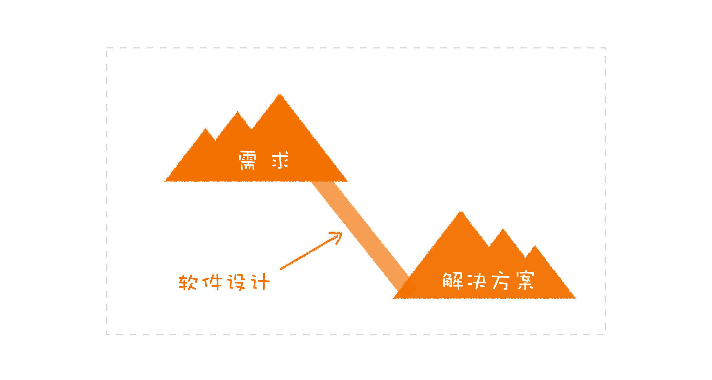
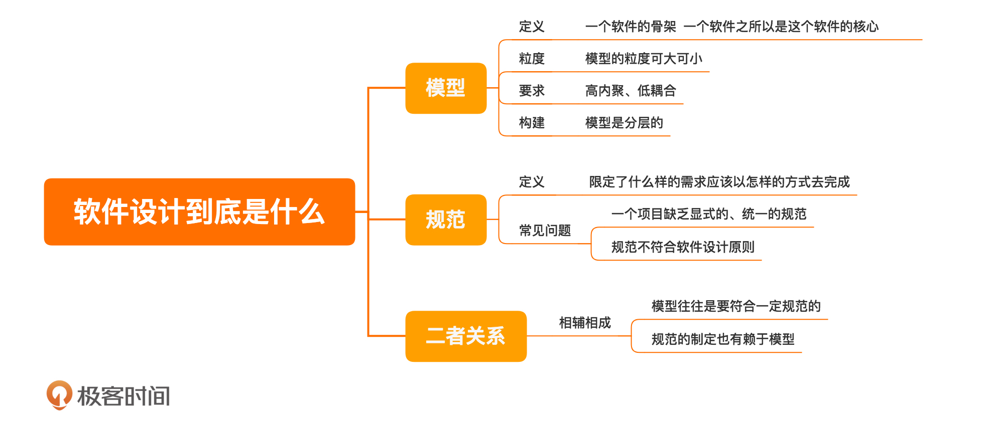

[toc]

## 01 | 软件设计到底是什么？

1.  前提：一个软件需要设计。
2.  那软件设计到底是什么？
    -   技术实现？
    -   框架和中间件？
    -   设计模式？
    -   MVC?

### 模型

1.  软件的开发目的是什么？
    -   解决由**需求带来的各种问题**。
    -   解决的结果是一个**可以运行的交付物**。
2.  软件设计在这个过程中做的事情是什么？
    -   在需要和解决方案之间架设一个**桥梁**。
    -   
3.  软件开发往往是长期的、多人参与的。
    -   这种情况下，就需要建立起一个**统一的结构**，以便所有人达成统一的共识。
    -   这种统一的结构就是模型，而软件设计就是要**构建出一套模型**。
4.  模型
    -  定义：是一个软件的**骨架**，**是一个软件之所以是这个软件的核心**。
    -  粒度：**可大可小**
    -  要求：**高内聚、低耦合**
    -  构建：**可分层**

### 规范

1.  定义：**就是限定了什么样的需求应该以怎样的方式去完成**。
2.  常见问题：
    -   **缺乏显式的、统一的规范**
    -   **规范不符合软件设计原则**

### 模型与规范

1.  模型与规范是什么关系呢？

    -   **二者相辅相成**

        >   模型符合一定的规范。
        >
        >   规范的制定也有赖于模型。

### 小结

1.  一句话总结：**软件设计，应该包括模型和规范**。
2.  

### 思考

1.  你的项目是如何做设计的？

### 精选留言

1.  #段启超

    >   防腐层是模型的一个规范，分享下我对防腐层的认知：
    >
    >   我接触防腐层的概念是从DDD的限界上下文开始的。Eric用细胞膜的概念来解释“限界”的概念，细胞膜只让细胞需要的物质进入细胞，同样，我们的代码之间业务也存在这个样一个界限，同一个对象的业务含义在不同的上下文中是不一样的。以在网上买书为例，在购买页面，我们的关注点在于这本书的名称，作者，以及分类，库存等信息；提交订单后，这本书就成为了订单上下文中的一个订单item，我们会关注这个item 的数量以及购买他的人是谁，以及书的配送地址等； 订单提交给仓库后，仓库会关心这本书还有没有库存，以及打包状态，分拣，物流等状态。
    >
    >   防腐层是在限界上下文之间映射（说白了就是交互）的方式，体现在代码上就是一个对象的转换，这个转换的意义在于隔离变化，防止因为对象在一个上下文中的变化扩散到其他的上下文中。
    >
    >   
    >
    >   关于规范：
    >
    >   规范也是团队文化中很重要的一部分，
    >
    >   以持续集成为例子，它的执行严格依赖于团队的开发纪律文化，以为了所谓赶进度而单元测试覆盖很低或者直接不写；
    >
    >   采用分支策略方开发，一星期都合并不了主干，类似的人到处倒是，也就因为这一点，很多团队都在持续集成这个环节上掉队了。
    >
    >   所以开发规范真的很重要，时刻谨记：混乱始于没有规范。

2.  #Kǎfκã²⁰²⁰

    >   业务讨论之后进行领域设计，画出出静态模型（包括子系统、模块等）和动态结构（交互等），或者先勾勒接口（内内外系统的区隔），再做模型。实际过程有很多反复，并且会进行角色代入，看模型能否支持业务，直到模型比较稳定

