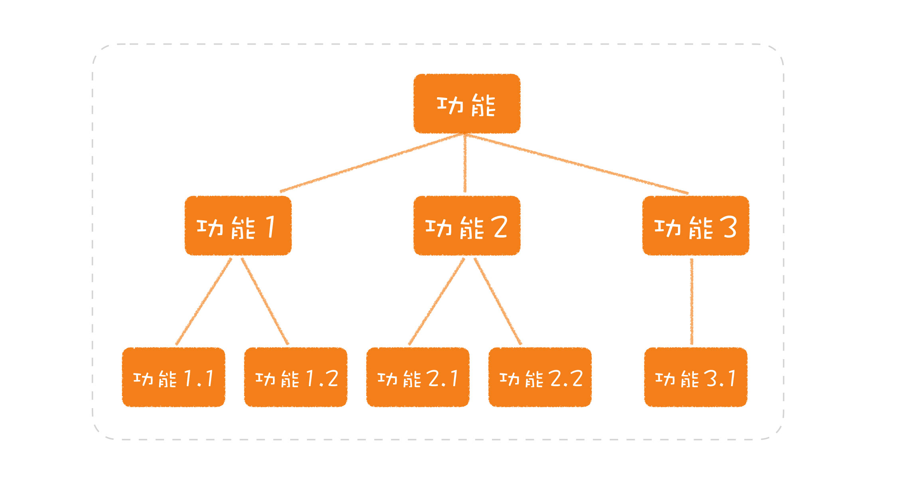
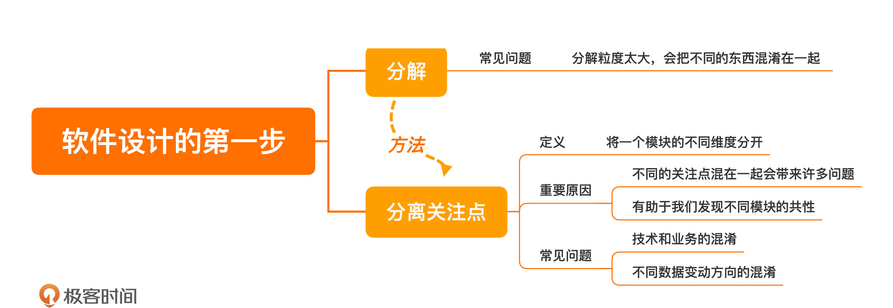

[toc]

## 02 | 分离关注点：软件设计至关重要的第一步

### 分解

1.  软件设计中至关重要的第一步：**分解**
2.  常见的问题：
    -   分解粒度太大，会把不同的东西混淆在一起。

### 分离关注点

1.  传统分解问题的方式：
    -   **树型**
    -   
2.  **定义**：
    -   我们在分解问题的时候，会有很多维度，**每一个维度都代表着一个关注点。**
3.  常见问题
    -   把**业务**处理和**技术**实现两个关注点混在了一起
    -   **不同的数据变动方向**
4.  重要的原因
    -   不同的关注点混在一起会带来一系列的问题，正如前面提到的各种问题
    -   当分解得足够细小，就有助于我们发现不同模块的共性，更好地进行设计。

### 小结

1.  一句话总结：
    -   **分离关注点，发现的关注点越多越好，粒度越小越好。**
2.  

### 思考题

1.  了解一下 CQRS（Command Query Responsibility Segregation），看看它分离了哪些关注点，以及在什么样的场景下使用这种架构是合理的。

### 精选留言

1.  #Jxin

    >   1.cqrs，命令与查询分离，最早是在ddd实战里面看到。其分离啦增删改与查询这两个关注点。
    >
    >   2.静态上，拆分了这两块的代码。使各自可以采用不同的技术栈，做针对性的调优。动态上，切分了流量，能够更灵活的做资源分配。
    >
    >   3.查询服务的实现。可以走从库，这有利于降低主库压力，也可以做到水平扩展。但需要注意数据延迟的问题。在异步同步和同步多写上要做好权衡。
    >
    >   也可以都走主库，这时候查询服务最好能增加缓存层，以降低主库压力，而增删改服务要做好缓存的级联操作，以保证缓存的时效性。
    >
    >   当然也可以走非关系型数据库，搜索引擎类的es,solr，分布式存储的tidb等等，按需选择。

