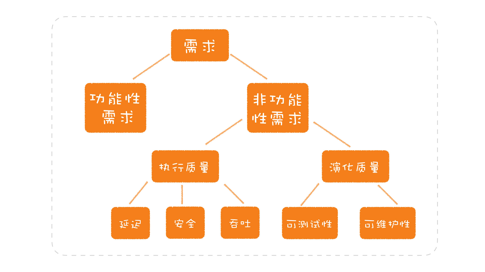

[toc]

## 03 | 可测试性：一个影响软件设计的重要因素

### 可测试性

1.  一个影响软件设计的重要因素：**可测试性**

    -	软件开发要解决的问题 ==>>> 需求：
        1.  功能性需求
        2.  非功能性需求
            -   执行质量：吞吐、延迟、安全
            -   深化质量：**可测试性**、可维护性、可扩展性
    -	
    
2.  常见问题

    -   可测试性常常被人忽视，**造成很多模块的不可测**，由此引发了很多技术债。

3.  在设计中，如何考虑可测试性？

    -   我们在设计一个函数 / 模块 / 系统时，必须将可测试性纳入考量，以便于能够完成不同层次的测试，减少对集成环境的依赖。

        >   具体该如何做呢？
        >
        >   
        >
        >   一方面，尽可能地给每个模块更多的测试，使构成系统的每个模块尽可能稳定，把集成测试环境更多地留作公共的验收资源。
        >
        >   另一方面，尽可能搭建本地的集成测试环境，周边的系统可以采用模拟服务的方案。

### 可测试性视角

1.  理解可测试性后
    -   可以把它当作**一个衡量标准去看待其他的设计或实践**。

    -   用它帮助我们理解软件的发展趋势。

        >   这是一种重要的开发趋势：**轻量级开发**。而这背后，重要的思维基础，就是**可测试性**。

### 小结

5.  一句话总结：**做软件设计，请考虑可测试性。**
6.  

### 思考题

1.  如果以可测试性衡量一下你开发过的系统，它的可测试性如何？有哪些问题是由于最初没有考虑可测试性造成的呢？

