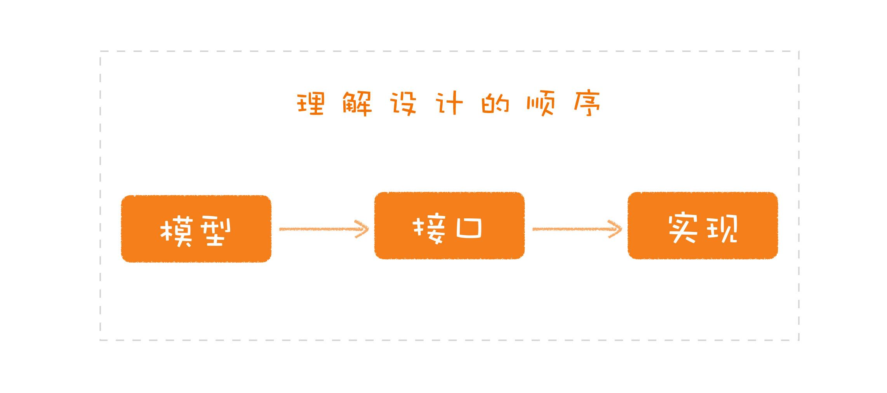
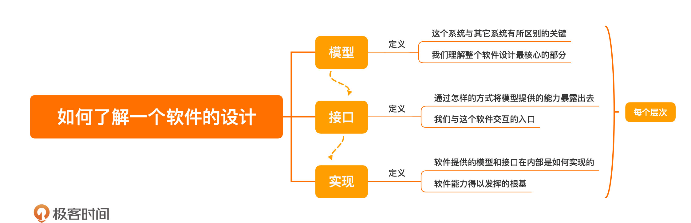

[toc]

## 04 | 三步走：如何了解一个软件的设计？

### 模型、接口、实现

1.  如何了解一个软件设计，可以从三部分入手：**模型、接口和实现**。
2.  **模型**（抽象）
    -   是一个软件的**核心**部分，是这个系统**与其它系统所区别的关键**，是我们理解整个软件设计最核心的部分。
3.  **接口**
    -   是通过**怎样的方式**将模型提供的能力暴露出去，是我们与这个**软件交互的入口**。
4.  **实现**
    -   就是软件提供的模型和接口的内部是**如何实现**的，是软件能力得以发挥的**根基**。

### 设计三步走

1.  前提
    -   区分模型、接口和实现的**关注点**。
    -   搞清楚“讨论的内容到底是什么？”
    
2.  了解设计的**顺序**
    -   先模型，再接口，最后是实现。
    -   

### 小结

1.  一句话总结：**了解设计，先模型、再接口、最后是实现**。
2.  

### 思考题

1.  每个开源项目都会提供一些不同的特点，请你找一些自己感兴趣的开源项目，看看它们分别提供了什么，是新的模型、是新的接口，还是新的实现？

### 精选留言

1.  #Kǎfκã²⁰²⁰

    >   模型，通常包含两类要素，
    >
    >   一是基本元素，二是这些元素之间的关系。比如常见的CRM，基本元素就包括项目、客户、合同和回款，相互之间的主要关系通常是客户报备，进入立项环节（评估投入产出），再签约，最后进入回款环节。这是基本模型。
    >
    >   这个模型（系统）的接口，就是要为BD提供从客户报备到签约、回款的整个流程管理。
    >
    >   实现就是要考虑如何用消息在这些模块之间传递数据，状态控制、数据查重锁定等等。