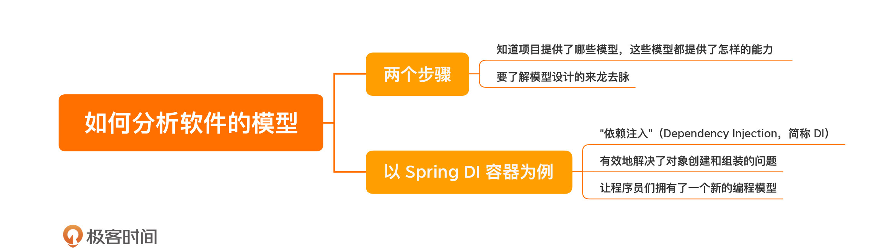

[toc]

## 05 | Spring DI 容器：如何分析一个软件的模型？

1.  了解设计的第一步：**模型**

2.  **理解模型**？

    -   要知道项目提供了**哪些模型**，这些模型都提供了**怎样的能力**。

    -   要了解模型设计的**来龙去脉**。

        >   **增进**对了解
        >
        >   **减少**对模型的破坏或滥用

3.  以 Spring DI 容器为例

    -   DI（Dependency Injection， “**依赖注入**”）

4.  DI 容器解决了什么问题？

    -   **对象的创建和组装**的问题。

    -   让程序员们拥有了一个新的**编程模型**

5.  对象的创建和组装，**耦合**的依赖，示例代码

    -   ```java
        
        class ArticlService {
          private ArticleRepository repository;
          
          public ArticlService(final Connection connection) {
            this.repository = new DBArticleRepository(connection);
          }
          
          public Article findByTitle(final String title) {
            // 做参数校验
            return this.repository.findByTitle(title);
          }
        }
        ```

6.  对象的创建和组装，**分离**的依赖，示例代码

    -   ```java
        
        class ArticleService {
          private ArticleRepository repository;
          
          public ArticleService(final ArticleRepository repository) {
            // 把对象创建的过程拿出去
            this.repository = repository;
          }
          
          public Article findByTitle(final String title) {
            // 做参数校验
            return this.repository.findByTitle(title);
          }
        }
        ```

    -   

### 小结

1.  一句话总结：**理解模型，要了解模型设计的来龙去脉**。
2.  

### 思考题

1.  DI 容器看上去如此地合情合理，为什么在其他编程语言的开发中，它并没有流行起来呢？

### 精选留言

1.  #Jxin

    >   1.斟酌再三，虽说直接说spring di容器好像也没啥毛病，但个人觉得这描述并不是很准确，故阐述下自己的认知。
    >
    >   2.我认为spring提供的这个编程模型应该叫ioc（控制反转和响应式编程有点像）而不是di。
    >
    >   因为最开始被提出来的是ioc（好莱坞原则），而且最早的实现也不是spring，jdk和ejb都有对ioc的实现，spring才是后来者。但是di确实好像是在spring上被流行起来，且长期主流的（spring di容器没毛病的原因）。
    >
    >   不过spring对ioc的实现，除了di还有依赖查找，在我眼里ioc是模型，依赖查找和依赖注入是功能，所以我认为应该是spring提供了ioc的编程模型，利用ioc容器+di的功能简化了开发。
    >
    >   3.依赖注入相对于依赖查找，透明度更好，调用方对ioc容器的api和具体接口实现的查表获取被隐藏了（技术与业务的解耦最终都该透明无感）。
    >
    >   但依赖查找在需要动态选择策略时依旧有其用武之地。
    >
    >   4.回答课后题：
    >
    >    对于py和go这类函数式编程语言，函数是一等公民，是可以作为参数传递的。那么直接改变所传的函数就可以实现mock和函数替换（使用和创建天然解耦）。
    >
    >    为什么java会流行？我认为有个原因，是因为java是单分派的语言，编译期方法和参数类型是绑定死的（强类型），运行期走哪个bean的方法是动态决定的。如此就引出了面向接口编程的多态实现方案，才会有后面ioc的诉求。

2.  #阳仔

    >   理解软件设计中模型首先要理解模型解决的核心问题是什么，
    >
    >   然后抽丝剥茧了解模型的来龙去脉，深入理解模型解决问题的过程。
    >
    >   spring中的di模型是为了解决对象的创建和组装的问题。
    >
    >   那为什么创建对象和组装要用di来解决？
    >
    >   一个重要的原因是为了解耦。
    >
    >   分离接口与实现的强依赖，也就是软件设计第一步分离关注点。
    >
    >   而这个恰恰就是为了可测试性，当一个代码是可测的，其实就是说明它是比较灵活的，修改起来不会牵一发而动全身，提高开发的体验，减少因修改引入的额外问题