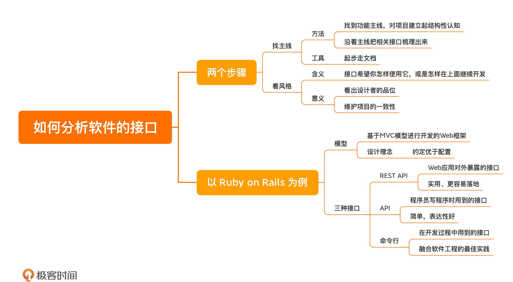

[toc]

## 06 | Ruby on Rails：如何分析一个软件的接口？

1.  了解设计的第二部分：**看接口**。
2.  看接口的方法：**找主线，看风格**
3.  找主线的**步骤**
    1.  先找到一条**功能主线**，对项目建立起结构性的了解。
        -   找项目主线的方法：**从文档开始。**
    2.  再沿着主线把相关接口梳理出来。

4.  看风格

    1.  含义：就是它希望你**怎样使用**它，或是怎样在上面继续开发。也就是项目作者引导人们怎样使用接口。

    2.  意义：

        -   看设计者的品位

        -   **维护项目的一致性**，必须有一个统一的风格。

5.  Ruby on Rails 模型

    -   Rails 是标准的**基于 MVC 模型进行开发的 Web 框架**

    -   Rails 一个重要的设计理念就是**约定优于配置**

    -   Rails 的接口

        >   Web 应用对外暴露的接口：REST API；
        >
        >   程序员写程序时用到的接口：API；
        >
        >   程序员在开发过程中用到的接口：命令行。

6.  REST API

    -   风格：**实用、更易落地**

    -   ```bash
        # 约定
        $ bin/rails routes
              Prefix Verb   URI Pattern                  Controller#Action
            articles GET    /articles(.:format)          articles#index
                     POST   /articles(.:format)          articles#create
         new_article GET    /articles/new(.:format)      articles#new
        edit_article GET    /articles/:id/edit(.:format) articles#edit
             article GET    /articles/:id(.:format)      articles#show
                     PATCH  /articles/:id(.:format)      articles#update
                     PUT    /articles/:id(.:format)      articles#update
                     DELETE /articles/:id(.:format)      articles#destroy
                root GET    /                            welcome#index
        ```

7.  API

    -   风格：**简单，表达性好**

    -   ```ruby
        # 数据库查询
        Article.find_by_title("foo")
        
        Article.find_by_title_and_author("foo", "bar")
        
        # 定义变量
        class Article < ApplicationRecord
          has_many :comments
          ...
        end
        ```

8.  命令行接口

    -   项目整合程度高度自动化

    -   风格：**它把当前软件工程方面的最佳实践融合进去**

### 小结

1.  一句话总结：**理解一个项目的接口，先找主线，再看风格。**
2.  

### 思考题

1.  一些好的开发习惯


