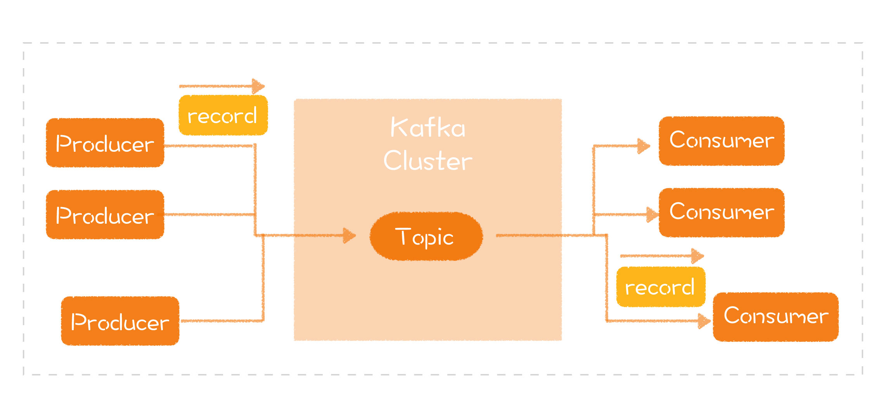

[toc]

## 07 | Kafka：如何分析一个软件的实现？

### 消息队列的模型与接口

### 关键技术

### 小结

1.  设计的第三部分：**看实现**。
    
    -   理解一个实现，是以对模型和接口的理解为前提的。
    
2.  了解系统的实现：

    -   **软件结构**
    -   **关键技术**

3.  Kafka 为例

    1.  核心模型：**消息队列**

    2.  接口：**生产、消费**

    3.  软件结构：

        -   含义：**分层**
        -   工具：结构图
        -   需要了解的：
            -   设计的**结果**
            -   设计的**动因**
        -   Kafka 架构图
            -   

    4.  关键技术：

        -   含义：就是能够让这个软件的“实现”**与众不同**的地方。

        -   特性：

            >   它针对写入做了优化，使得它的整体吞吐能力特别强。
            >
            >   
            >
            >   Kafka 的不同之处在于，它利用了**磁盘顺序读写**的特性

4.  一句话总结：**理解实现，带着自己的问题，了解软件的结构和关键的技术。**

5.  