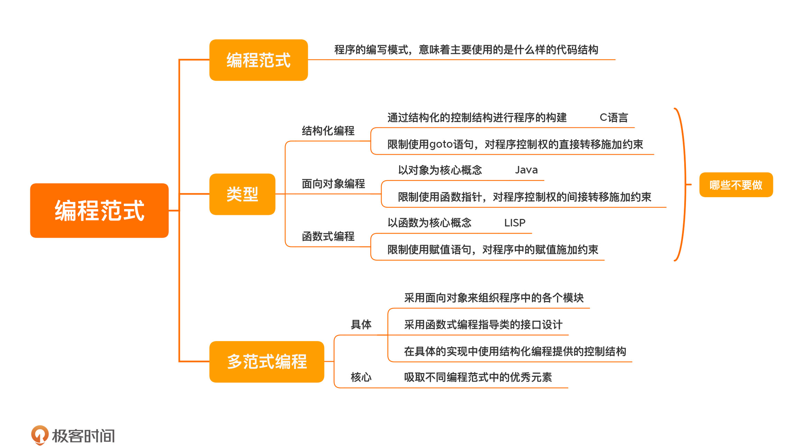

[toc]

## 12 | 编程范式：明明写的是Java，为什么被人说成了C代码？

### 编程范式

1.  含义：
    
    -   指的是程序的**编写模式**（使用的是什么样的代码结构）。
    
2.  三种主流和编程范式
    -	结构化编程（structured programming）
    -	面向对象编程（object-oriented programming）
    -	函数式编程（functional programming）
    
3.  结构化编程

    -   它通过一些**结构化的控制结构**进行程序的构建。
    -   选择结构：if/else
    -   循环结构：do/while
    -   最典型的结构化编程语言： **C 语言**。

4.  面向对象编程

    -   核心概念：**对象**
    -   程给我们提供了一种**管理程序复杂性**的方式，其中最重要的概念就是**多态**（polymorphism）。

    -   最典型的代表： Java

5.  函数式编程

    -   核心概念：**函数**
    -   **不变性**：一个符号一旦创建就不再改变。
    -   代表性语言：LISP

6.  编程范式对程序员的能力施加了**约束**，理解编程范式的一个关键点在于：**哪些事情不要做**。

### 多范式编程

1.  学习不同的编程范式，将**不同**编程范式中的**优秀**元素吸纳进来。这里的重点是“优秀”，而非“所有”。
2.  示例：
    -   采用面向对象来组织程序
    -   在每个类具体的接口设计上，采用函数式编程的风格
    -   在具体的实现中使用结构化编程提供的控制结构

### 小结

1.  一句话总结：**学习不同的编程范式，将其中优秀的元素运用在日常工作中。**
2.  

### 思考题

1.  今天我想请你分享一下，你在学习其他编程范式时，给你思想上带来最大冲击的内容是什么。

### 精选留言

1.  #Kǎfκã²⁰²¹

    >   当Bob大叔说出那句，“编程范式本质是从某方面对程序员编程能力的限制和规范”时，真有些振聋发聩

2.  #chenzesam

    >   不单止编程范式对程序员的能力做了限制，编程框架也在开始做这一方面的努力了。努力提高程序员的下限。

