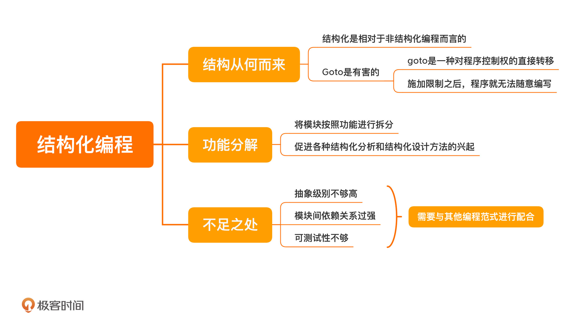

[toc]

## 13 | 结构化编程：为什么做设计时仅有结构化编程是不够的？

### 结构化

1.  所谓结构化，**是相对于非结构化编程而言的**。
2.  在非结构编程（汇编语言）中，使用 goto（它可以让代码跳转到另外一个地方继续执行）来做类似结构化逻辑处理。

3.  Goto 不足：
    -   代码规模稍微一大，就几乎难以维护。
    -   影响了递归拆分，导致问题无法被拆分。
4.  结构化编程的思想
    -   最初是为了证明程序正确性而诞生的。

### 功能分解

1.  含义：
    -   将模块按照功能进行**拆分**。
    -   也就是将大问题拆分成可以解决的小问题
2.  作用：
    -   促进各种**结构化分析**和**结构化设计**的方法的发展。

### 不足

1.  **抽象级别不够高**
    -   程序规模越来越大，则无法应对
2.  **依赖关系过强**
    -   不能有效地隔离变化
3.  **可测试性不够**
    -   它的依赖关系太强，很难拆出来单独测试一个模块。

### 小结

1.  一句话总结：**结构化编程不能有效地隔离变化，需要与其他编程范式配合使用。**
2.  

### 思考题

1.  你在学习哪门技术时，了解到其背后思想之后，让你觉得受到了很大的震撼。

