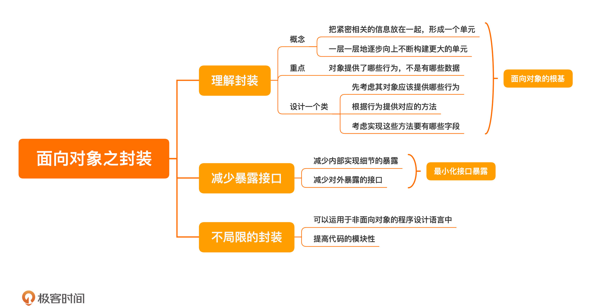

[toc]

## 14 | 面向对象之封装：怎样的封装才算是高内聚？

### 理解封装

1.  **面向对象**是解决**更大规模**应用开发的一种尝试，它提升了程序员管理程序的尺度。

2.  **封装**，则是面向对象的根基。

3.  概念

    -   它把紧密相关的信息放在一起，形成一个单元。
    -   一层一层地逐步向上，构建更大的单元。

4.  面向对象给我们一个**更宏观**的思考方式。

    -   将一个个小的单元组织起来，形成一个大的单元，当去观察大单元的时候，就不用再去考虑每个小单元是怎样的。

5.  重点

    -   **在于对象提供了哪些行为**，而不是有哪些数据。

6.  设计一个类

    1.  先要考虑其对象应该提供**哪些行为**。

    2.  然后，我们根据这些行为提供对应的**方法**，

        >   注意:
        >
        >   方法的命名，体现的是你的**意图**，而不是具体怎么做。
        >
        >   所以，getXXX 和 setXXX 绝对不是一个好的命名。
        >
        >   
        >
        >   **将意图与实现分离开来** <-- 设计时必须要考虑的问题。

    3.  最后，才是考虑实现这些方法要有**哪些字段**。

### 减少暴露接口

1.  **减少这个单元对外的暴露**
    -   第一层含义，减少内部**实现细节**的暴露，
    -   第二层含义，减少对外暴露的**接口**。
2.  软件设计原则：
    -   **最小化接口暴露**

### 不局限于面向对象的封装

1.  当理解了封装之后
    -   可以把它运用于**非**面向对象的程序设计语言中
    -   把代码写得更具**模块性**。

### 小结

1.  一句话总结：**基于行为进行封装，不要暴露实现细节，最小化接口暴露。**
2.  

### 思考题

1.  了解一下迪米特法则（Law of Demeter）
    -   参考：[“迪米特法则”理论描述](https://github.com/wtfocus/geek-architecture-notes/blob/master/%E8%AE%BE%E8%AE%A1%E6%A8%A1%E5%BC%8F%E4%B9%8B%E7%BE%8E/22-%E7%90%86%E8%AE%BA%E5%85%AB%EF%BC%9A%E5%A6%82%E4%BD%95%E7%94%A8%E8%BF%AA%E7%B1%B3%E7%89%B9%E6%B3%95%E5%88%99%EF%BC%88LOD%EF%BC%89%E5%AE%9E%E7%8E%B0%E2%80%9C%E9%AB%98%E5%86%85%E8%81%9A%E3%80%81%E6%9D%BE%E8%80%A6%E5%90%88%E2%80%9D%EF%BC%9F.md#%E8%BF%AA%E7%B1%B3%E7%89%B9%E6%B3%95%E5%88%99%E7%90%86%E8%AE%BA%E6%8F%8F%E8%BF%B0)

### 精选留言

1.  #Being

    >   “迪米特法则”，印象最深的就是“不要和陌生人说话”。
    >
    >   今天学习了本节课程，有了些启示，也可以理解为只和陌生人表达确定性意图。
    >
    >   每暴露一个公共API就增加一份职责，所以在每次暴露API时就要问自己，这个职责是自己必要的，还是有可能会增加不必要的负担。