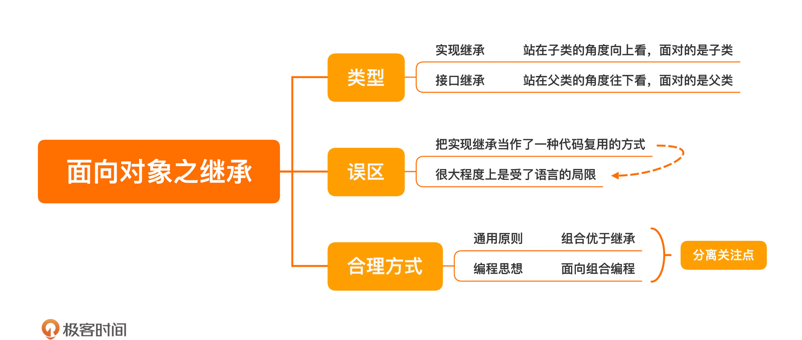

[toc]

## 15 | 面向对象之继承：继承是代码复用的合理方式吗？

1.  分类
    -   **实现继承**：站在**子类**的角度向上看。在客户端代码使用的时候，面对的是子类。（**本节重点**）
    -   接口继承：从**父类**的角度往下看，客户端使用的时候，面对的是父类

3.  误区：
    -   **把实现继承当作一种代码复用的方式** （不推荐）

1.  设计原则：
    -   **组合优于继承**
2.  组合 vs 继承：
    -   在“实现继承”场景中，优先使用“**组合**”方式。

5.  **向组合编程**

    -   概念：类是由多个小**模块**组合而成

    -   面向对象面向的是“**对象**”，不是类。

    -   对象本身就是一个独立的个体  -- Alan Kay 

    -   支撑面向组合编程的是**分离关注点**

        >   将不同的关注点分离出来，每一个关注点成为一个模块，在需要的时候组装起来。

    -   在设计上可以降低程序的复杂度，更是思维上的转变。

### 小结

1.  一句话总结：**组合优于继承**
2.  

### 思考题

1.  了解一下一种叫DCI （Data，Context 和 Interaction）的编程思想，结合今天的课程，分享一下你对 DCI 的理解。

