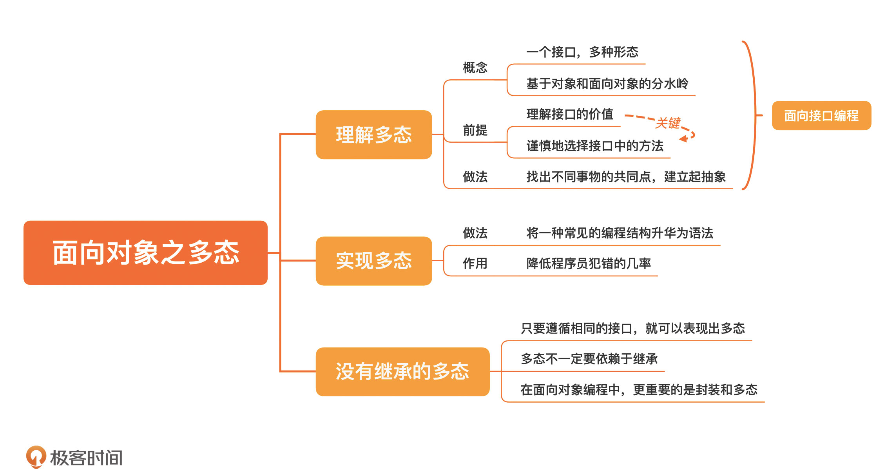

[toc]

## 16 | 面向对象之多态：为什么“稀疏平常”的多态，是软件设计的大杀器？

### 理解多态

1.  概念：

    -   **一个接口，多种形态**。
    -   基于对象与面向对象的分水岭。

2.  前提：理解接口

    1.  **接口继承**，主要是给多态用的。

    2.  要想理解多态，首先要理解**接口的价值**，最关键的就是在于**谨慎地选择接口中的方法**。

        -   **接口将变的部分和不变的部分隔离开来**。

            >   不变的部分就是接口的约定
            >
            >   变的部分就是子类各自的实现。

        -   接口是一个**边界**。

3.  方法

    -   需要找出**不同**事物的**共同点**（地基还是在**分离关注点上**），**构建起抽象**。

### 实现多态

1.  做法
    -   做法由一种编程结构变成了一种**语法**。
2.  作用
    -   犯错误的几率就大大降低了
    -   程序行为的可预期性就大大提高了

### 没有继承的多态

1.  多态**并不一定**要依赖于继承。

    -   只要能够**遵循相同的接口**，就可以表现出来多态。
    -   多态依赖于继承，这只是某些程序设计语言自身的特点。

2.  实现

    -   两个类可以不在同一个继承体系之下。只要**有同样的方法接口** ，就是一种多态。如 Duck Typing

        -   ```java
            
            class Duck
              def quack
                # 鸭子叫
              end
            end
            
            class FakeDuck
              def quack
                # 模拟鸭子叫
              end
            end
            
            def make_quack(quackable)
              quackable.quack
            end
            
            make_quack(Duck.new)
            make_quack(FakeDuck.new)
            ```

3.  面向对象的三大特点

    1.  **封装**是面向对象的**根基**，软件就是靠各种封装好的对象逐步组合出来的；
    2.  **继承**给了继承体系内的所有对象一个**约束**，让它们有了统一的行为；
    3.  **多态**让整个体系能够更好地**应对未来的变化**。

### 小结

1.  一句话总结：**建立起恰当的抽象，面向接口编程。**
2.  

### 思考题

1.  了解一下 Go 语言或 Rust 语言是如何支持多态的

### 精选留言

1.  