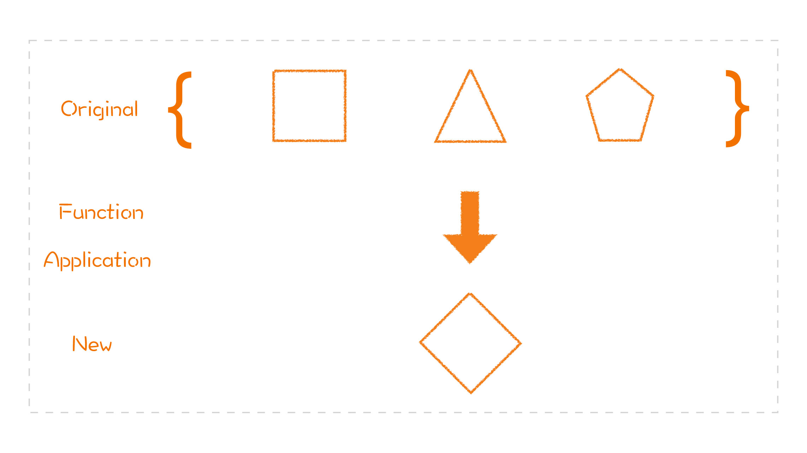

[toc]

## 18 | 函数式编程之组合性：函数式编程为什么如此吸引人？

1.  函数式编程在设计上的两个特性：
    -   **组合性**（本节重点）
    -   不变性

### 高阶函数

1.  概念

    -   **可以接收函数作为输入，或者返回一个函数作为输出。**

2.  作用

    -   可以用它去做**行为的组合**。

        -   ```java
            
            find(byName(name).and(bySno(sno)));
            ```

3.  函数式编程风格

    -   模型**提供者**提供出来的是一个又一个的**构造块**，以及它们的**组合方式**。
    -   **使用者**根据自己需要将这些构造块**组合**起来，提供出新的模型，供其他开发者使用。

4.  从设计的角度看

    -   这种模型**层层叠加**，是一种好的设计方式。

### 列表转换思维

1.  大部分操作最后都可以归结成**列表转换**（数据经过一系列的列表转换会得到一个结果）。
    -   

2.  最基础的列表转换有三种典型模式：
    -   map
    -   filter
    -   reduce
3.  **map**，把一组数据通过一个函数**映射**为另一组数据。
    -   
4.  **filter**，把一组数据按照某个条件进行**过滤**，只有满足条件的数据才会留下。
    -   
5.  **reduce**，就是把一组数据按照某个规则，**归约**为一个数据。
    -   
6.  函数式列表转换，优势
    1.  更具有**表达性**
    2.  可以用作组合的基础接口，可以在多种场合**复用**

### 面向对象组合 vs 函数式编程组合

1.  **面向对象**组合的元素是**类和对象**，而**函数式编程**组合的是**函数**。
2.  **面向对象**关键在于**结构的组合**，而用**函数式编程**在于函数**接口的设计**
3.  同样需要“**分离关注点**”。

### 小结

1.  一句话总结：**设计可以组合的函数接口**。
2.  