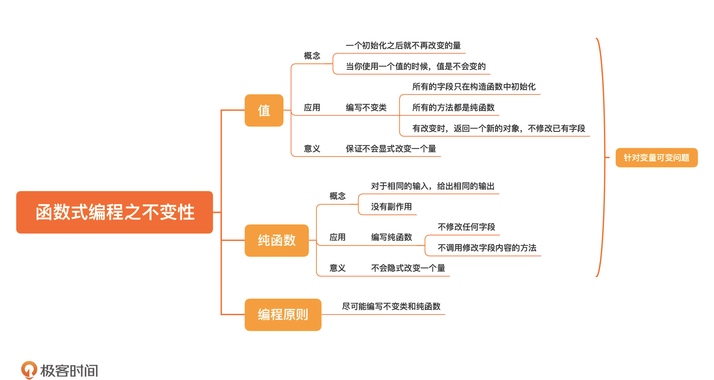

[toc]

## 19 | 函数式编程之不变性：怎样保证我的代码不会被别人破坏？

### 不变性

1. 值

    1. 概念

        -   一个初始化后就不再改变的量。

        
    2.　应用

        1.　编写不变类，对象一旦构造出来就不能改变。
        2.　怎样编写不变类？
            -   所有的字段只在**构造函数**中初始化；
            -   所有的方法都是**纯函数**；
            -   如果需要有改变，返回一个**新的对象**，而不是修改已有字
            
            
    3. 意义
        
        1.  保证不会**显式**改变一个量

    

2. 纯函数

    1. 概念

        -   相同输入，相同输出
        -   没有副作用
        
        
        
    2. 应用
        1.　**不修改任何字段**
        2.　**不调用修改字段内容的方法。**

        

    3. 意义
        
        1.  保证不会**隐式**改变一个量。

    

3. 编程建议

    -   使用语法中**不变的修饰符**。如 java 中的 final，C/C++ 中的 const

4. 编程原则

    -   **尽可能编写不变类和纯函数**
    -   不变性，是减少程序问题的一个重要努力方向。

### 小结

1.　一句话总结：**尽量编写不变类和纯函数。**
2.　