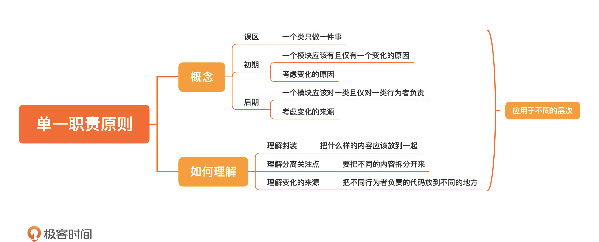

[toc]

## 20 | 单一职责原则：你的模块到底为谁负责？

1.  SOLID 原则
    -   **单一职责原则（Single responsibility principle，SRP）**
    -   开放封闭原则（Open–closed principle，OCP）
    -   Liskov 替换原则（Liskov substitution principle，LSP）
    -   接口隔离原则（Interface segregation principle，ISP）
    -   依赖倒置原则（Dependency inversion principle，DIP）

### 单一职责原则

1. 误解

    -   一个类只做一件事
    -   "单一职责原则" vs "一个类只干一件事之间"，最大的差别就是，**将变化纳入了考量**。

2.　关注点

    -   如何**分解**

3.　理想状态

    -   一个模块最理想的状态是**不改变**，其次是**少改变**。

4. 概念

    -   **一个模块应该有且仅有一个变化的原因** -- 《敏捷软件开发：原则、实践与模式》
    -   **一个模块应该对一类且仅对一类行为者（actor）负责** -- 《架构整洁之道》

5.　初期：**一个模块应该有且仅有一个变化的原因**

    1.　考虑的是**变化的原因**
    2.　实践：按**需求**分类

6.　后期：**一个模块应该对一类且仅对一类行为者（actor）负责**

    1.　康威定律

        >   一个组织设计出的系统，其结构受限于其组织的沟通结构。

    2.　单一职责原则：一个软件系统的最佳结构**高度依赖于使用这个软件的组织的内部结构**。

    3.　考虑的是**变化的来源**

    4.　实践：按**行为者**分类

5.　理解单一职责原则
    1.　我们需要理解**封装**，知道要把什么样的内容放到一起；
    2.　我们需要理解**分离关注点**，知道要把不同的内容拆分开来；
    3.　我们需要理解**变化的来源**，知道把不同行为者负责的代码放到不同的地方。

### 小结

1.　一句话总结：**应用单一职责原则衡量模块，粒度越小越好。**
2.　