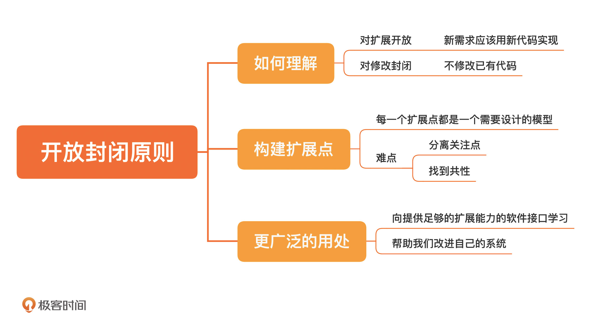

[toc]

## 21 | 开放封闭原则：不改代码怎么写新功能？

1.  概念

    -   **对扩展开放，对修改封闭。** -- 《面向对象软件构造》. Bertrand Meyer
    
    - 　对扩展开放
        -   新需求应该用新代码实现
        
    - 　对修改封闭
        -   不修改已有代码
        
2.　前提
    -   在软件内部留好**扩展点**。因为每一个扩展点都是一个需要设计的**模型。**

### 构建扩展点

1.  阻碍程序员们构造出稳定模块的障碍，其实是**构建模型的能力**。
2.  难点
    1.　**分离关注点**
    2.　**找到共性**
3.  方向/目标
    -   每做一次这种模型构建，最核心的类就会朝着**稳定**的方向迈进一步。
4.  改进的起点
    -   通过查看自己的源码控制系统，找出那些最经常**变动**的文件

### 小结

1.　一句话总结：**设计扩展点，迈向开放封闭原则。**
2.　
