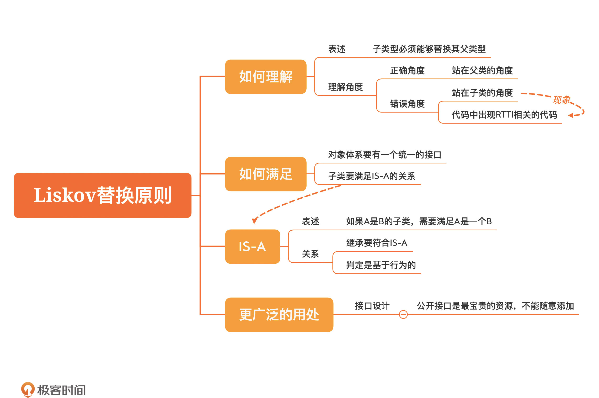

[toc]

## 22 | Liskov替换原则：用了继承，子类就设计对了吗？

1.  继承指导原则　-- **Liskov 替换原则（Liskov substitution principle，简称 LSP）。**
2.  概念
    -   **子类型（subtype）必须能够替换其父类型（base type）**
3.  违反 Liskov 替换原则
    -   **没有统一的处理接口**
    -   **做运行时类型识别的代码**
4.  IS-A 的关系
    -   **如果 A 是 B 的子类，就需要满足 A 是一个 B（A is a B）**
    -   IS-A 关键在于**行为**，只有**行为一致**，才能说是满足 IS-A 的关系。
5.  如何满足 LSP
    -   首先，这个对象体系要有一个**统一的接口**，而不能各行其是
    -   其次，子类要满足 **IS-A** 的关系。
6.  LSP 的关注点
    -   把注意力放到**父类**上
    -   **接口继承**才是我们的努力方向，才会更符合 LSP。
7.  LSP 应用：接口设计
    -   公开接口是最宝贵的资源，千万**不能随意添加**。
    -   所有代码的**行为**保持**一致性，核心的代码**结构也保持**稳定**。

###  小结

1.　一句话总结：**用父类的角度去思考，设计行为一致的子类。**
2.　