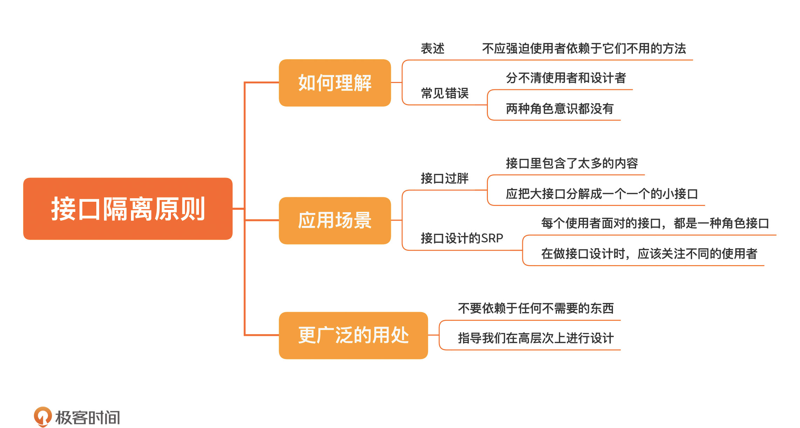

[toc]

## 23 | 接口隔离原则：接口里的方法，你都用得到吗？

1. 接口隔离原则（Interface segregation principle，简称 ISP）

    -   **不应强迫使用者依赖于它们不用的方法**。（就是指在接口中，不要放置使用者用不到的方法）

2.　接口设计过“胖”

    -   包含了太多的内容

    -   **把大接口分解成一个一个的小接口。**

3.　接口设计的 SRP

    -   **识别出接口不同的角色**至关重要

4.　更广泛的理解

    1.　**不要依赖于任何不需要的东西**，指导我们在高层次上进行设计。

### 小结

1.　一句话总结：**识别对象的不同角色，设计小接口。**
2.　