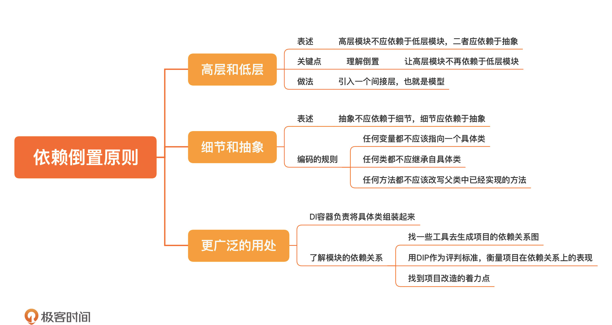

[toc]

## 24 | 依赖倒置原则：高层代码和底层代码，到底谁该依赖谁？

### 依赖倒置原则

1.　依赖倒置原则（Dependency inversion principle，简称 DIP）
    -   **（倒置）高层模块不应依赖于低层模块，二者应依赖于抽象。**
    -   **抽象不应依赖于细节，细节应依赖于抽象。**
2.　从软件设计角度分析
    -   软件设计需要关注长期、放眼长期，所有那些不在自己掌控之内的东西，都是有可能被替换的。
    -   依赖于一个可能会变的东西，从设计的角度看，并不是一个好的做法。
3.　高层模块**不直接依赖**低层模块，而是将依赖关系“**倒置**”过来，让低层模块去依赖由高层定义好的**接口**。这样做的好处就在于，将高层模块与低层实现**解耦**开来。

### 依赖于抽象

1. 设计思想

    -   尽可能把变的部分和不变的部分分开，让不变的部分稳定下来。

2.　依赖于抽象

    -   **抽象不应依赖于细节，细节应依赖于抽象。**

    -   一些更具体的指导编码的规则

        >   任何变量都不应该指向一个具体类；
        >
        >   任何类都不应继承自具体类；
        >
        >   任何方法都不应该改写父类中已经实现的方法。

3. 扩展

    -   **好莱坞规则**

        >   “Don’t call us, we’ll call you”
        >
        >   “别调用我，我会调你的”

    -   对于任何一个项目，**了解不同模块的依赖关系**，极为重要。

### 小结

1.　一句话总结：**依赖于构建出来的抽象，而不是具体类。**
2.　