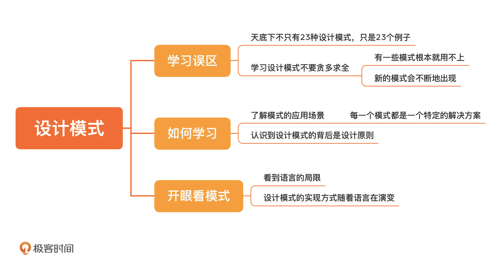

[toc]

## 25 | 设计模式：如何理解和学习设计模式

### 设计模式

1.　学习误区
    -   **不要贪多求全**
2.　每一个模式都是一个特定的**解决方案**
3.　学习设计模式不仅仅要学习代码怎么写，更重要的是要了解模式的**应用场景**。

### 从原则到模式

1.　设计原则
    -   讨论各种问题的**基础**
    -   原则是模式背后的东西
2.　设计模式
    -   在特定场景下，对于经常发生的问题，给出的一个可复用的**解决方案**。
    -   设计模式只是设计原则在**特定场景**下的应用。

### 开眼看模式

1.　设计模式在某种意义上就是为了**解决语言自身缺陷**的一种权宜之计　-- 《动态语言的设计模式》
2.　随着时代的发展，一些模式已经不再适用了。

### 小结

1.  一句话总结
    -   **学习设计模式，从设计原则开始，不局限于模式。**
2.  