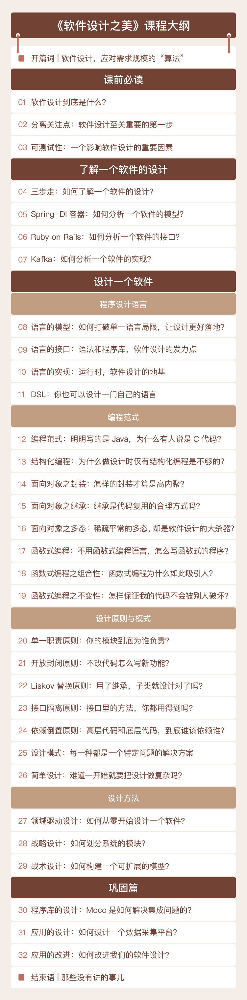

[toc]

## 开篇词 | 软件设计，应对需求规模的“算法”

### 软件设计是什么？

1.  软件设计，**实际上就是应对需求规模的“算法”。**

### 如何学习软件设计？

1.  学习软件设计，不在于一招一式，而在于**融会贯通**。

2.  软件设计的两个维度：
    -   **了解**现有软件的设计
    -   自己**设计**一个软件
3.  如何快速了解现有软件的设计？
    -   抓住这个软件最核心的三个部分：**模型、接口、实现**。
4.  软件设计中最重要的部分
    -   **程序设计语言**
        -   择其善者而从之
    -   **编程范式**
        -   结构化编程、面向对象和函数式编程
    -   **设计原则**
        -   SOLID 原则
    -   **设计模式**
        -   设计原则在具体场景下的应用
    -   **设计方法**
        -   领域驱动设计（DDD）

### 专栏目录

1.  

### 其他

1.  《10x 程序员工作法》这门课是在告诉你要**做正确的事，做有价值的需求**，别把时间浪费在不该做的事情上。
2.  《软件设计之美》这门课就是告诉你**如何把事做对，如何建立有效的模型，划清模块之间的边界**，所以，二者可谓一脉相承。

